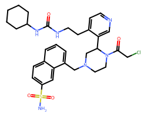

| CID (canonical)     | description                                                                                                                                                                                                                                                                                                                                                                                                                                                                                                                                                                                                                                                                                                                                                                                                                                                                                                                                                                                                                                                                                                                                                                                                                                                                                                                                                                                                                                                                                                                                                                                                                                                                                                                                                                                                                                                                                                                                                                                                                                                                                                                                                                                                                                                                                                                                                                                                                                                                                                                                                                                                                                                                                                                                                                                                                                                                                                                                                                                                                                                                                                                                                                                                                                                                                                                                                                                                                                                  |   postera_SAScore |   postera_minNumSteps | image                                                           |
|:--------------------|:-------------------------------------------------------------------------------------------------------------------------------------------------------------------------------------------------------------------------------------------------------------------------------------------------------------------------------------------------------------------------------------------------------------------------------------------------------------------------------------------------------------------------------------------------------------------------------------------------------------------------------------------------------------------------------------------------------------------------------------------------------------------------------------------------------------------------------------------------------------------------------------------------------------------------------------------------------------------------------------------------------------------------------------------------------------------------------------------------------------------------------------------------------------------------------------------------------------------------------------------------------------------------------------------------------------------------------------------------------------------------------------------------------------------------------------------------------------------------------------------------------------------------------------------------------------------------------------------------------------------------------------------------------------------------------------------------------------------------------------------------------------------------------------------------------------------------------------------------------------------------------------------------------------------------------------------------------------------------------------------------------------------------------------------------------------------------------------------------------------------------------------------------------------------------------------------------------------------------------------------------------------------------------------------------------------------------------------------------------------------------------------------------------------------------------------------------------------------------------------------------------------------------------------------------------------------------------------------------------------------------------------------------------------------------------------------------------------------------------------------------------------------------------------------------------------------------------------------------------------------------------------------------------------------------------------------------------------------------------------------------------------------------------------------------------------------------------------------------------------------------------------------------------------------------------------------------------------------------------------------------------------------------------------------------------------------------------------------------------------------------------------------------------------------------------------------------------------|------------------:|----------------------:|:----------------------------------------------------------------|
| WIL-LEE-364b6ea8-4  | The candidates were generated using a genetic algorithm to optimise the geometric similarity between the molecules and the 3D alignment of the fragment hits. The initial population comprises all PostEra submissions as of March 22nd. The fitness of a member of the population is measured by assessing the similarity of its SOAP descriptor with that of the “target molecular field” (the SOAP descriptor generated using the PDB 3D co-ordinates of fragments at a particular binding site). We focus on sites 2 and 11, and the fitness function is the product of the similarities with target molecular fields for sites 2 and 11. The populations are evolved by performing mutating/breeding molecular graphs as described in https://doi. org/10. 1039/C8SC05372C. I ve selected x0072 as the fragment id but really the submissions will be based on whichever fragments have been used as inspiration for the previous submissions. In principle should be biased towards fragments that bind to sites 2 and 11                                                                                                                                                                                                                                                                                                                                                                                                                                                                                                                                                                                                                                                                                                                                                                                                                                                                                                                                                                                                                                                                                                                                                                                                                                                                                                                                                                                                                                                                                                                                                                                                                                                                                                                                                                                                                                                                                                                                                                                                                                                                                                                                                                                                                                                                                                                                                                                                                              |          0.720322 |                     9 |    |
| JON-UNI-57097b3f-5  | USRCAT comparison with oligopeptide transition state from the quantum corona project, an important addition to previous work is the use of tethered conformations with respect to the TS. If the tethered minimisation fails, the candidate molecule is rejected - which seems to be a strong/interesting filter for relevant molecules. I severely reduced the allowed SAscores as well In collaboration with Jeriek van Den Abeele                                                                                                                                                                                                                                                                                                                                                                                                                                                                                                                                                                                                                                                                                                                                                                                                                                                                                                                                                                                                                                                                                                                                                                                                                                                                                                                                                                                                                                                                                                                                                                                                                                                                                                                                                                                                                                                                                                                                                                                                                                                                                                                                                                                                                                                                                                                                                                                                                                                                                                                                                                                                                                                                                                                                                                                                                                                                                                                                                                                                                         |          0.62031  |                     8 |    |
| WIL-LEE-364b6ea8-18 | The candidates were generated using a genetic algorithm to optimise the geometric similarity between the molecules and the 3D alignment of the fragment hits. The initial population comprises all PostEra submissions as of March 22nd. The fitness of a member of the population is measured by assessing the similarity of its SOAP descriptor with that of the “target molecular field” (the SOAP descriptor generated using the PDB 3D co-ordinates of fragments at a particular binding site). We focus on sites 2 and 11, and the fitness function is the product of the similarities with target molecular fields for sites 2 and 11. The populations are evolved by performing mutating/breeding molecular graphs as described in https://doi. org/10. 1039/C8SC05372C. I ve selected x0072 as the fragment id but really the submissions will be based on whichever fragments have been used as inspiration for the previous submissions. In principle should be biased towards fragments that bind to sites 2 and 11                                                                                                                                                                                                                                                                                                                                                                                                                                                                                                                                                                                                                                                                                                                                                                                                                                                                                                                                                                                                                                                                                                                                                                                                                                                                                                                                                                                                                                                                                                                                                                                                                                                                                                                                                                                                                                                                                                                                                                                                                                                                                                                                                                                                                                                                                                                                                                                                                              |          0.507286 |                     8 |  |
| AGN-NEW-9d245c51-4  | Structure-guided lead optimisation.                                                                                                                                                                                                                                                                                                                                                                                                                                                                                                                                                                                                                                                                                                                                                                                                                                                                                                                                                                                                                                                                                                                                                                                                                                                                                                                                                                                                                                                                                                                                                                                                                                                                                                                                                                                                                                                                                                                                                                                                                                                                                                                                                                                                                                                                                                                                                                                                                                                                                                                                                                                                                                                                                                                                                                                                                                                                                                                                                                                                                                                                                                                                                                                                                                                                                                                                                                                                                          |          0.632371 |                     8 |    |
| AGN-NEW-9d245c51-5  | Structure-guided lead optimisation.                                                                                                                                                                                                                                                                                                                                                                                                                                                                                                                                                                                                                                                                                                                                                                                                                                                                                                                                                                                                                                                                                                                                                                                                                                                                                                                                                                                                                                                                                                                                                                                                                                                                                                                                                                                                                                                                                                                                                                                                                                                                                                                                                                                                                                                                                                                                                                                                                                                                                                                                                                                                                                                                                                                                                                                                                                                                                                                                                                                                                                                                                                                                                                                                                                                                                                                                                                                                                          |          0.626779 |                     8 |    |
| NIM-UNI-363644a0-2  | Combining fragments x0770 and x0946, and the key pyridine seen in x0426, x0434 and many other fragments Fragalysis Snapshot: https://fragalysis. diamond. ac. uk/viewer/react/snapshot/95a6097f-7be1-4ad1-808c-b959f06f6929                                                                                                                                                                                                                                                                                                                                                                                                                                                                                                                                                                                                                                                                                                                                                                                                                                                                                                                                                                                                                                                                                                                                                                                                                                                                                                                                                                                                                                                                                                                                                                                                                                                                                                                                                                                                                                                                                                                                                                                                                                                                                                                                                                                                                                                                                                                                                                                                                                                                                                                                                                                                                                                                                                                                                                                                                                                                                                                                                                                                                                                                                                                                                                                                                                  |          0.504776 |                     7 |    |
| WIL-LEE-364b6ea8-32 | The candidates were generated using a genetic algorithm to optimise the geometric similarity between the molecules and the 3D alignment of the fragment hits. The initial population comprises all PostEra submissions as of March 22nd. The fitness of a member of the population is measured by assessing the similarity of its SOAP descriptor with that of the “target molecular field” (the SOAP descriptor generated using the PDB 3D co-ordinates of fragments at a particular binding site). We focus on sites 2 and 11, and the fitness function is the product of the similarities with target molecular fields for sites 2 and 11. The populations are evolved by performing mutating/breeding molecular graphs as described in https://doi. org/10. 1039/C8SC05372C. I ve selected x0072 as the fragment id but really the submissions will be based on whichever fragments have been used as inspiration for the previous submissions. In principle should be biased towards fragments that bind to sites 2 and 11                                                                                                                                                                                                                                                                                                                                                                                                                                                                                                                                                                                                                                                                                                                                                                                                                                                                                                                                                                                                                                                                                                                                                                                                                                                                                                                                                                                                                                                                                                                                                                                                                                                                                                                                                                                                                                                                                                                                                                                                                                                                                                                                                                                                                                                                                                                                                                                                                              |          0.626773 |                     7 |  |
| MAT-GIT-deadff56-4  | Hi, here is a quick idea for growing the fluoroindole fragment (x010) via merging with other fragments and aiming to harness a Met-chloro halogen bond. Best wishes, Matthias    Cl added to interact with Met 165. Very interesting idea - submitted on github (https://github. com/m2ms/fragalysis-frontend/issues/169)                                                                                                                                                                                                                                                                                                                                                                                                                                                                                                                                                                                                                                                                                                                                                                                                                                                                                                                                                                                                                                                                                                                                                                                                                                                                                                                                                                                                                                                                                                                                                                                                                                                                                                                                                                                                                                                                                                                                                                                                                                                                                                                                                                                                                                                                                                                                                                                                                                                                                                                                                                                                                                                                                                                                                                                                                                                                                                                                                                                                                                                                                                                                    |          0.486155 |                     7 |    |
| SAM-UNK-83e03154-3  | Adaptations of submissions SAM-UNK-903-1 and SAM-UNK-903-2 to introduce greater rigidity and therefore reduce the entropic penalty of binding                                                                                                                                                                                                                                                                                                                                                                                                                                                                                                                                                                                                                                                                                                                                                                                                                                                                                                                                                                                                                                                                                                                                                                                                                                                                                                                                                                                                                                                                                                                                                                                                                                                                                                                                                                                                                                                                                                                                                                                                                                                                                                                                                                                                                                                                                                                                                                                                                                                                                                                                                                                                                                                                                                                                                                                                                                                                                                                                                                                                                                                                                                                                                                                                                                                                                                                |          0.423517 |                     7 |    |
| JAN-LUN-04aedcc0-3  | Covalent ligands: Idea was based on a previous design with scaffold based on fragments in site 1 (His163/Glu166 motive) The idea was based on a compound binding close to His163 where the possibility of specific interaction to side chains was limited to extend this based on other fragments with modifications to promote binding to Asn 189, &lu166 and Asn 142 side chains. This was combined with fragments 1392 or 1412 for covalent linkage with CYS145.                                                                                                                                                                                                                                                                                                                                                                                                                                                                                                                                                                                                                                                                                                                                                                                                                                                                                                                                                                                                                                                                                                                                                                                                                                                                                                                                                                                                                                                                                                                                                                                                                                                                                                                                                                                                                                                                                                                                                                                                                                                                                                                                                                                                                                                                                                                                                                                                                                                                                                                                                                                                                                                                                                                                                                                                                                                                                                                                                                                          |          0.670462 |                     7 |    |
| FRA-DIA-8640f307-3  | A few merges that would populate all four subsites (S1, S1 , S2, S3). x0397 reaches from S1 to S1 , and its N-methyl group points towards S2 (aromatic wheel) and S3. x0395 sits one C-C away from that N-methyl group; one half sits in S1 , the other (non-aromatic) half in S2. Finally, replace that non-aromatic half with x0104, which reaches from S2 to S3. Try the nitrile and fluoro that poke into the H61/M165 hole for various hits - and toss in a chloro for good measure Why this might not work:  H61, C145 and M165 move quite a lot for x0397, away from how they are for the aromatic hole. And probably a bitch to synthesise                                                                                                                                                                                                                                                                                                                                                                                                                                                                                                                                                                                                                                                                                                                                                                                                                                                                                                                                                                                                                                                                                                                                                                                                                                                                                                                                                                                                                                                                                                                                                                                                                                                                                                                                                                                                                                                                                                                                                                                                                                                                                                                                                                                                                                                                                                                                                                                                                                                                                                                                                                                                                                                                                                                                                                                                           |          0.519048 |                     7 |    |
| FRA-DIA-8640f307-2  | A few merges that would populate all four subsites (S1, S1 , S2, S3). x0397 reaches from S1 to S1 , and its N-methyl group points towards S2 (aromatic wheel) and S3. x0395 sits one C-C away from that N-methyl group; one half sits in S1 , the other (non-aromatic) half in S2. Finally, replace that non-aromatic half with x0104, which reaches from S2 to S3. Try the nitrile and fluoro that poke into the H61/M165 hole for various hits - and toss in a chloro for good measure Why this might not work:  H61, C145 and M165 move quite a lot for x0397, away from how they are for the aromatic hole. And probably a bitch to synthesise                                                                                                                                                                                                                                                                                                                                                                                                                                                                                                                                                                                                                                                                                                                                                                                                                                                                                                                                                                                                                                                                                                                                                                                                                                                                                                                                                                                                                                                                                                                                                                                                                                                                                                                                                                                                                                                                                                                                                                                                                                                                                                                                                                                                                                                                                                                                                                                                                                                                                                                                                                                                                                                                                                                                                                                                           |          0.517183 |                     7 |    |
| BOW-UNK-ca7e31b7-1  | come from an AI-aided covalent inhibitor discovery project    AI-aided targeted covalent inhibitors design against SARAS-COV-2 .                                                                                                                                                                                                                                                                                                                                                                                                                                                                                                                                                                                                                                                                                                                                                                                                                                                                                                                                                                                                                                                                                                                                                                                                                                                                                                                                                                                                                                                                                                                                                                                                                                                                                                                                                                                                                                                                                                                                                                                                                                                                                                                                                                                                                                                                                                                                                                                                                                                                                                                                                                                                                                                                                                                                                                                                                                                                                                                                                                                                                                                                                                                                                                                                                                                                                                                             |          0.632165 |                     6 |    |
| JIG-UNK-11bede03-2  | Here, the approach was to improve the physicochemical property of the lead (published on March 20, cited below) by retaining the activity (IC50 = 0. 67 ± 0. 18 µM for compound 13b). The replacement of the phenyl ring to the bicyclo-pentane would increase the solubility. Also, it can prevent the para-hydroxylation of the phenyl ring. Moreover, these compounds showed increase bioavailability scores, a decrease in the rotatable bonds and molecular weight as compared to the lead molecule (Compound 13b). However, docking studies would help to understand the binding efficacy of these molecules The physicochemical properties were checked through SwissADME (http://www. swissadme. ch/index. php)     Crystal structure of SARS-CoV-2 main protease provides a basis for design of improved α-ketoamide inhibitors, published on March 20. (https://science. sciencemag. org/content/early/2020/03/20/science. abb3405  )                                                                                                                                                                                                                                                                                                                                                                                                                                                                                                                                                                                                                                                                                                                                                                                                                                                                                                                                                                                                                                                                                                                                                                                                                                                                                                                                                                                                                                                                                                                                                                                                                                                                                                                                                                                                                                                                                                                                                                                                                                                                                                                                                                                                                                                                                                                                                                                                                                                                                                              |          0.62509  |                     6 |    |
| KEI-UNI-85a52787-10 | Four key pockets targeted in 3-way merge with X0831 as core:  1) Halogen pocket of X0946 & X0104  2) Pyridine pocket of X0434 & X0678 (but removing the dependency on aniline/urea motifs)  3) Polar pocket of X0104 & X0946  4) Core (flat) aryl pocket amended to X0831, shared by the above and many others. Design by eye. Synthesis moderately involved, but very modular Possible chiral synthesis of core by desymmetrisation of achiral 1,4 diazepane. Very modular N-functionalisation possible                                                                                                                                                                                                                                                                                                                                                                                                                                                                                                                                                                                                                                                                                                                                                                                                                                                                                                                                                                                                                                                                                                                                                                                                                                                                                                                                                                                                                                                                                                                                                                                                                                                                                                                                                                                                                                                                                                                                                                                                                                                                                                                                                                                                                                                                                                                                                                                                                                                                                                                                                                                                                                                                                                                                                                                                                                                                                                                                                     |          0.487985 |                     6 |  |
| BEN-VAN-d2b455e2-12 | CHEMICAL PROFILE     Molecules designed by Benjamin P. Brown   Graduate student in the laboratory of Jens Meiler, Ph. D. Email: benjamin. p. brown@vanderbilt. edu      Notes on the chemical profile:    Design protocol: Fragments co-crystalized with COVID-19 main protease (released by the Diamond Xchem group) served as starting   scaffolds for combinatorial chemistry with an in-development Meiler Lab algorithm called BCL::LinkFragments. After filtering ~800,000 fragment combinations for physchem properties, geometry (i. e. pocket complementarity), and predicted activity, we performed focused library design (BCL::FocusedLibraryDesign) on a subset of the best new molecules. The variation of this algorithm    utilized for this study incorporated a conventional supervised feed-forward deep neural network (DNN) as a pose-dependent protein-ligand  interface scorer. Fragments were perturbed in a Monte Carlo - Metropolis fashion using alchemical transformations, and refined at each step to minimize clashes, optimize pose orientation, and filter out unstable/non-drug-like modifications. Molecules are optimized for clash resolution and interaction score. The best molecules undergo a final short run of BCL::FocusedLibraryDesign, and minor manual modifications are selectively made to intentionally increase probing of the structure-activity relationship (SAR). Finally, compounds are re-docked with RosettaLigand. The top-scoring complex is taken to be the final pose. Note that in multiple instances there is more than 1 well-populated binding pose. Here, we simply took the best scoring pose. Also note that the pose optimizing the RosettaLigand score is not the same pose that optimizes the DNN score. Nomenclature: XLogP, XLogS, and XdG_Hyd are LogP, LogS, and dg_hydration (kcal/mol) predictions made using a multi-tasking deep neural network trained in the BCL. LipinksiDruglike returns 1 if there are less than 2 Lipinksi violations. RS_Score_Raw and RSCONVOL_Score_Raw are two novel (in preparation) scoring functions developed in the BCL that use a DNN to prediction the binding affinity of small molecules to receptors (in units of -log(Kd)) using either pose-dependent or pose-dependent+pose-independent protein-ligand hybrid descriptors. RS_AD and RSCONVOL_AD are applicability domain (AD) metrics of the DNN scores; values less_equal 0. 90 are generally considered good and mean we trust the corresponding activity prediction reasonably well. RosettaLigandInterfaceScore is the interface_delta_X (protein-ligand interaction score) from Rosetta v3. 11 of the best pose in Talaris2014 Rosetta energy units (REU). MoleculeComplexity is a metric by Ertl. et al. , 2009, Journal of Cheminformatics, and generally less than 2. 5 indicates the molecule is reasonably synthesizable This cluster was selected to promote diversity. Very different core and general shape of the molecule compared to the other clusters we submitted. Generally, this one has lower predicted affinity than the other clusters we submitted; however, perhaps it has potential to be a good covalent inhibitor. We are currently running MD simulations on these to see if any of the warhead geometries favor covalent adduct formation. Additional docking poses, score vs RMSD plots, and predicted activity/physchem data available upon request |          0.527917 |                     6 |  |
| KEI-UNI-85a52787-4  | Four key pockets targeted in 3-way merge with X0831 as core:  1) Halogen pocket of X0946 & X0104  2) Pyridine pocket of X0434 & X0678 (but removing the dependency on aniline/urea motifs)  3) Polar pocket of X0104 & X0946  4) Core (flat) aryl pocket amended to X0831, shared by the above and many others. Design by eye. Synthesis moderately involved, but very modular Possible chiral synthesis of core by desymmetrisation of achiral 1,4 diazepane. Very modular N-functionalisation possible                                                                                                                                                                                                                                                                                                                                                                                                                                                                                                                                                                                                                                                                                                                                                                                                                                                                                                                                                                                                                                                                                                                                                                                                                                                                                                                                                                                                                                                                                                                                                                                                                                                                                                                                                                                                                                                                                                                                                                                                                                                                                                                                                                                                                                                                                                                                                                                                                                                                                                                                                                                                                                                                                                                                                                                                                                                                                                                                                     |          0.517512 |                     6 |    |
| ADR-MCR-f276533c-1  | This is a more rigid version of the alpha-ketoamide inhibitor recently published in Science by the Zhang and Hilgenfeld team at DZIF in Germany. The central peptide connection has been replaced by a carboxy indole group which may provide an alternative synthesis Attribution of the inspirational structure: L. Zhang et al. , Science 10. 1126/science. abb3405 (2020)                                                                                                                                                                                                                                                                                                                                                                                                                                                                                                                                                                                                                                                                                                                                                                                                                                                                                                                                                                                                                                                                                                                                                                                                                                                                                                                                                                                                                                                                                                                                                                                                                                                                                                                                                                                                                                                                                                                                                                                                                                                                                                                                                                                                                                                                                                                                                                                                                                                                                                                                                                                                                                                                                                                                                                                                                                                                                                                                                                                                                                                                                |          0.651206 |                     6 |    |
| JAN-LUN-04aedcc0-4  | Covalent ligands: Idea was based on a previous design with scaffold based on fragments in site 1 (His163/Glu166 motive) The idea was based on a compound binding close to His163 where the possibility of specific interaction to side chains was limited to extend this based on other fragments with modifications to promote binding to Asn 189, &lu166 and Asn 142 side chains. This was combined with fragments 1392 or 1412 for covalent linkage with CYS145.                                                                                                                                                                                                                                                                                                                                                                                                                                                                                                                                                                                                                                                                                                                                                                                                                                                                                                                                                                                                                                                                                                                                                                                                                                                                                                                                                                                                                                                                                                                                                                                                                                                                                                                                                                                                                                                                                                                                                                                                                                                                                                                                                                                                                                                                                                                                                                                                                                                                                                                                                                                                                                                                                                                                                                                                                                                                                                                                                                                          |          0.661626 |                     6 |    |
| BEN-VAN-d2b455e2-22 | CHEMICAL PROFILE     Molecules designed by Benjamin P. Brown   Graduate student in the laboratory of Jens Meiler, Ph. D. Email: benjamin. p. brown@vanderbilt. edu      Notes on the chemical profile:    Design protocol: Fragments co-crystalized with COVID-19 main protease (released by the Diamond Xchem group) served as starting   scaffolds for combinatorial chemistry with an in-development Meiler Lab algorithm called BCL::LinkFragments. After filtering ~800,000 fragment combinations for physchem properties, geometry (i. e. pocket complementarity), and predicted activity, we performed focused library design (BCL::FocusedLibraryDesign) on a subset of the best new molecules. The variation of this algorithm    utilized for this study incorporated a conventional supervised feed-forward deep neural network (DNN) as a pose-dependent protein-ligand  interface scorer. Fragments were perturbed in a Monte Carlo - Metropolis fashion using alchemical transformations, and refined at each step to minimize clashes, optimize pose orientation, and filter out unstable/non-drug-like modifications. Molecules are optimized for clash resolution and interaction score. The best molecules undergo a final short run of BCL::FocusedLibraryDesign, and minor manual modifications are selectively made to intentionally increase probing of the structure-activity relationship (SAR). Finally, compounds are re-docked with RosettaLigand. The top-scoring complex is taken to be the final pose. Note that in multiple instances there is more than 1 well-populated binding pose. Here, we simply took the best scoring pose. Also note that the pose optimizing the RosettaLigand score is not the same pose that optimizes the DNN score. Nomenclature: XLogP, XLogS, and XdG_Hyd are LogP, LogS, and dg_hydration (kcal/mol) predictions made using a multi-tasking deep neural network trained in the BCL. LipinksiDruglike returns 1 if there are less than 2 Lipinksi violations. RS_Score_Raw and RSCONVOL_Score_Raw are two novel (in preparation) scoring functions developed in the BCL that use a DNN to prediction the binding affinity of small molecules to receptors (in units of -log(Kd)) using either pose-dependent or pose-dependent+pose-independent protein-ligand hybrid descriptors. RS_AD and RSCONVOL_AD are applicability domain (AD) metrics of the DNN scores; values less_equal 0. 90 are generally considered good and mean we trust the corresponding activity prediction reasonably well. RosettaLigandInterfaceScore is the interface_delta_X (protein-ligand interaction score) from Rosetta v3. 11 of the best pose in Talaris2014 Rosetta energy units (REU). MoleculeComplexity is a metric by Ertl. et al. , 2009, Journal of Cheminformatics, and generally less than 2. 5 indicates the molecule is reasonably synthesizable This cluster was selected to promote diversity. Very different core and general shape of the molecule compared to the other clusters we submitted. Generally, this one has lower predicted affinity than the other clusters we submitted; however, perhaps it has potential to be a good covalent inhibitor. We are currently running MD simulations on these to see if any of the warhead geometries favor covalent adduct formation. Additional docking poses, score vs RMSD plots, and predicted activity/physchem data available upon request |          0.567223 |                     6 |  |
| BEN-VAN-d2b455e2-19 | CHEMICAL PROFILE     Molecules designed by Benjamin P. Brown   Graduate student in the laboratory of Jens Meiler, Ph. D. Email: benjamin. p. brown@vanderbilt. edu      Notes on the chemical profile:    Design protocol: Fragments co-crystalized with COVID-19 main protease (released by the Diamond Xchem group) served as starting   scaffolds for combinatorial chemistry with an in-development Meiler Lab algorithm called BCL::LinkFragments. After filtering ~800,000 fragment combinations for physchem properties, geometry (i. e. pocket complementarity), and predicted activity, we performed focused library design (BCL::FocusedLibraryDesign) on a subset of the best new molecules. The variation of this algorithm    utilized for this study incorporated a conventional supervised feed-forward deep neural network (DNN) as a pose-dependent protein-ligand  interface scorer. Fragments were perturbed in a Monte Carlo - Metropolis fashion using alchemical transformations, and refined at each step to minimize clashes, optimize pose orientation, and filter out unstable/non-drug-like modifications. Molecules are optimized for clash resolution and interaction score. The best molecules undergo a final short run of BCL::FocusedLibraryDesign, and minor manual modifications are selectively made to intentionally increase probing of the structure-activity relationship (SAR). Finally, compounds are re-docked with RosettaLigand. The top-scoring complex is taken to be the final pose. Note that in multiple instances there is more than 1 well-populated binding pose. Here, we simply took the best scoring pose. Also note that the pose optimizing the RosettaLigand score is not the same pose that optimizes the DNN score. Nomenclature: XLogP, XLogS, and XdG_Hyd are LogP, LogS, and dg_hydration (kcal/mol) predictions made using a multi-tasking deep neural network trained in the BCL. LipinksiDruglike returns 1 if there are less than 2 Lipinksi violations. RS_Score_Raw and RSCONVOL_Score_Raw are two novel (in preparation) scoring functions developed in the BCL that use a DNN to prediction the binding affinity of small molecules to receptors (in units of -log(Kd)) using either pose-dependent or pose-dependent+pose-independent protein-ligand hybrid descriptors. RS_AD and RSCONVOL_AD are applicability domain (AD) metrics of the DNN scores; values less_equal 0. 90 are generally considered good and mean we trust the corresponding activity prediction reasonably well. RosettaLigandInterfaceScore is the interface_delta_X (protein-ligand interaction score) from Rosetta v3. 11 of the best pose in Talaris2014 Rosetta energy units (REU). MoleculeComplexity is a metric by Ertl. et al. , 2009, Journal of Cheminformatics, and generally less than 2. 5 indicates the molecule is reasonably synthesizable This cluster was selected to promote diversity. Very different core and general shape of the molecule compared to the other clusters we submitted. Generally, this one has lower predicted affinity than the other clusters we submitted; however, perhaps it has potential to be a good covalent inhibitor. We are currently running MD simulations on these to see if any of the warhead geometries favor covalent adduct formation. Additional docking poses, score vs RMSD plots, and predicted activity/physchem data available upon request |          0.521513 |                     6 |  |
| WIL-LEE-364b6ea8-5  | The candidates were generated using a genetic algorithm to optimise the geometric similarity between the molecules and the 3D alignment of the fragment hits. The initial population comprises all PostEra submissions as of March 22nd. The fitness of a member of the population is measured by assessing the similarity of its SOAP descriptor with that of the “target molecular field” (the SOAP descriptor generated using the PDB 3D co-ordinates of fragments at a particular binding site). We focus on sites 2 and 11, and the fitness function is the product of the similarities with target molecular fields for sites 2 and 11. The populations are evolved by performing mutating/breeding molecular graphs as described in https://doi. org/10. 1039/C8SC05372C. I ve selected x0072 as the fragment id but really the submissions will be based on whichever fragments have been used as inspiration for the previous submissions. In principle should be biased towards fragments that bind to sites 2 and 11                                                                                                                                                                                                                                                                                                                                                                                                                                                                                                                                                                                                                                                                                                                                                                                                                                                                                                                                                                                                                                                                                                                                                                                                                                                                                                                                                                                                                                                                                                                                                                                                                                                                                                                                                                                                                                                                                                                                                                                                                                                                                                                                                                                                                                                                                                                                                                                                                              |          0.608453 |                     6 |    |
| AGN-NEW-9d245c51-3  | Structure-guided lead optimisation.                                                                                                                                                                                                                                                                                                                                                                                                                                                                                                                                                                                                                                                                                                                                                                                                                                                                                                                                                                                                                                                                                                                                                                                                                                                                                                                                                                                                                                                                                                                                                                                                                                                                                                                                                                                                                                                                                                                                                                                                                                                                                                                                                                                                                                                                                                                                                                                                                                                                                                                                                                                                                                                                                                                                                                                                                                                                                                                                                                                                                                                                                                                                                                                                                                                                                                                                                                                                                          |          0.435766 |                     6 |    |
| AGN-NEW-9d245c51-1  | Structure-guided lead optimisation.                                                                                                                                                                                                                                                                                                                                                                                                                                                                                                                                                                                                                                                                                                                                                                                                                                                                                                                                                                                                                                                                                                                                                                                                                                                                                                                                                                                                                                                                                                                                                                                                                                                                                                                                                                                                                                                                                                                                                                                                                                                                                                                                                                                                                                                                                                                                                                                                                                                                                                                                                                                                                                                                                                                                                                                                                                                                                                                                                                                                                                                                                                                                                                                                                                                                                                                                                                                                                          |          0.389887 |                     6 |    |
| AGN-NEW-051944a9-4  | Structure-guided lead optimisation and molecular docking.                                                                                                                                                                                                                                                                                                                                                                                                                                                                                                                                                                                                                                                                                                                                                                                                                                                                                                                                                                                                                                                                                                                                                                                                                                                                                                                                                                                                                                                                                                                                                                                                                                                                                                                                                                                                                                                                                                                                                                                                                                                                                                                                                                                                                                                                                                                                                                                                                                                                                                                                                                                                                                                                                                                                                                                                                                                                                                                                                                                                                                                                                                                                                                                                                                                                                                                                                                                                    |          0.404891 |                     6 |    |
| MIH-UNI-3396182e-9  | Used fragment hotspot mapping to identify highly scoring areas within the bound fragments in the fragment screen. Linked and merged combinations of highly scoring subfragments from only the noncovalent set                                                                                                                                                                                                                                                                                                                                                                                                                                                                                                                                                                                                                                                                                                                                                                                                                                                                                                                                                                                                                                                                                                                                                                                                                                                                                                                                                                                                                                                                                                                                                                                                                                                                                                                                                                                                                                                                                                                                                                                                                                                                                                                                                                                                                                                                                                                                                                                                                                                                                                                                                                                                                                                                                                                                                                                                                                                                                                                                                                                                                                                                                                                                                                                                                                                |          0.376531 |                     5 |    |
| YUN-WES-64c64eb2-4  | These compounds are inspired by the alpha-ketoamide bound crystal structure (6Y2F) and designed based on our experience on the lead-optimization of alpha-ketoamides for inhibiting a cysteine protease calpain2 (J Am Chem Soc. 2017,doi. org/10. 1021/jacs. 7b08938). To achieve the optimal binding, we kept the P1 and P2 sidechains to mimic the substrate peptide, and explored the chemical space of P1  and P3 using the fragment map-based approach described in J. Chem. Inf. Model. 2019, doi. org/10. 1021/acs. jcim. 8b00959. The fragment maps were obtained from http://demo. silcsbio. com/covid-19/. These compounds are inspired by the alpha-ketoamide bound crystal structure (6Y2F) and designed based on our experience on the lead-optimization of alpha-ketoamides for inhibiting a cysteine protease calpain2 (J Am Chem Soc. 2017,doi. org/10. 1021/jacs. 7b08938). To achieve the optimal binding, we kept the P1 and P2 sidechains to mimic the substrate peptide and focused on exploring larger chemical space of P1  and P3 using the fragment map-based approach described in J. Chem. Inf. Model. 2019, doi. org/10. 1021/acs. jcim. 8b00959. The fragment maps were obtained from http://demo. silcsbio. com/covid-19/                                                                                                                                                                                                                                                                                                                                                                                                                                                                                                                                                                                                                                                                                                                                                                                                                                                                                                                                                                                                                                                                                                                                                                                                                                                                                                                                                                                                                                                                                                                                                                                                                                                                                                                                                                                                                                                                                                                                                                                                                                                                                                                                                                                                     |          0.634372 |                     5 |    |
| INS-INS-714f82db-1  | Molecular modeling was performed using the Quantum-Based Structure Builder (QSB) module. This module consists of two functional parts. The first provides pharmacophore-based mapping of targeted cavity by molecular fragments (probes) with their further minimization. The second subprogram provides step-by-step linking of building blocks to the probes, taking into account the protein environment. Since ligands of crystal structures acted as initial probes in current experiment, only the second part of QSB module was used. As starting molecules, ligands from 5REY, 5REN, 5RFG crystals were used. Model was built based on protein structure from 6LU7 crystal. Libraries of building blocks were obtained by fragmentation of molecules from Enamine 10K diverse collection with BRICS algorithm. Five stages of structure building have been completed. In the first two stages, libraries of larger fragments (linkers) were used in order to extend the scaffold structure. At each of these two consecutive steps, the top 20 structures were selected by the module based on calculated energy values and then the top 5 of them were selected for further calculations based on expert evaluation. The next 3 stages were aimed at linking small functional groups and were performed automatically. During the first two stages the 5 best structures were automatically selected for the next step. At the final step, the 20 best structures in terms of energy were retained                                                                                                                                                                                                                                                                                                                                                                                                                                                                                                                                                                                                                                                                                                                                                                                                                                                                                                                                                                                                                                                                                                                                                                                                                                                                                                                                                                                                                                                                                                                                                                                                                                                                                                                                                                                                                                                                                                                                                  |          0.419323 |                     5 |    |
| JON-UIO-f971c856-8  | These designs are based on a generative machine learning model trained on very broad collection of known anti-viral compounds (HIV-1 Protease inhibitors, Ebola and Herpes antivirals,. ) and a hand curated selection of related molecules. The set of molecules generated by this model are then scored on chemical similarity to the COVID-19 / SARS-CoV-2 protease transition state analogue inhibitor template generated by the Quantum Corona project. The resulting high-scoring molecules were filtered on a series of AMDE and toxicity conditions, including Veber, Egan and Muegge violations. All molecules presented here are P-glycoprotein substrates, have a high GI absorption and have a favorable bioavailability score. The final subsection of molecules presented here was decided on by hand based on a range of factors including synthetic accessibility and some diversity measures Special thanks to Jeriek Van den Abeele at UiO s Department of Physics for computational support and to Jarvist Moore Frost at Imperial College London s Blackett Laboratory for kick-starting the the Quantum Corona project and making the protease transition state analogue inhibitor template widely available                                                                                                                                                                                                                                                                                                                                                                                                                                                                                                                                                                                                                                                                                                                                                                                                                                                                                                                                                                                                                                                                                                                                                                                                                                                                                                                                                                                                                                                                                                                                                                                                                                                                                                                                                                                                                                                                                                                                                                                                                                                                                                                                                                                                                            |          0.494995 |                     5 |    |
| NIM-UNI-7ba87d62-1  | Cytosine core to merge fragments. Fragalysis snapshot https://fragalysis. diamond. ac. uk/viewer/react/snapshot/33e8072d-50cb-410d-825f-1ea1dc27bea8                                                                                                                                                                                                                                                                                                                                                                                                                                                                                                                                                                                                                                                                                                                                                                                                                                                                                                                                                                                                                                                                                                                                                                                                                                                                                                                                                                                                                                                                                                                                                                                                                                                                                                                                                                                                                                                                                                                                                                                                                                                                                                                                                                                                                                                                                                                                                                                                                                                                                                                                                                                                                                                                                                                                                                                                                                                                                                                                                                                                                                                                                                                                                                                                                                                                                                         |          0.322194 |                     5 |    |
| INS-INS-7e24ab41-1  | Molecular modeling was performed using the Quantum-Based Structure Builder (QSB) module. This module consists of two functional parts. The first provides pharmacophore-based mapping of targeted cavity by molecular fragments (probes) with their further minimization. The second subprogram provides step-by-step linking of building blocks to the probes, taking into account the protein environment. Since ligands of crystal structures acted as initial probes in current experiment, only the second part of QSB module was used. As starting molecules, ligands from 5REY, 5REN, 5RFG crystals were used. Model was built based on protein structure from 6LU7 crystal. Libraries of building blocks were obtained by fragmentation of molecules from Enamine 10K diverse collection with BRICS algorithm. Five stages of structure building have been completed. In the first two stages, libraries of larger fragments (linkers) were used in order to extend the scaffold structure. At each of these two consecutive steps, the top 20 structures were selected by the module based on calculated energy values and then the top 5 of them were selected for further calculations based on expert evaluation. The next 3 stages were aimed at linking small functional groups and were performed automatically. During the first two stages the 5 best structures were automatically selected for the next step. At the final step, the 20 best structures in terms of energy were retained                                                                                                                                                                                                                                                                                                                                                                                                                                                                                                                                                                                                                                                                                                                                                                                                                                                                                                                                                                                                                                                                                                                                                                                                                                                                                                                                                                                                                                                                                                                                                                                                                                                                                                                                                                                                                                                                                                                                                  |          0.455862 |                     5 |    |
| HUB-UNK-9845d277-9  | Using the crystollagraphic data published by Hilgenfeld et al. (Science 2020), we derived these structures. Thereby, we focused on derivatives with a good synthetic accessibility. Maintaining the pyridinone-moiety, we tried to mimic the binding modes of fragments 0072, 0434, 0678, 0692 and 0770 as well as inhibitor 13b (pdb: 6y2g). The central aromatic ring might be well positioned in the hydrophobic S2 pocket-connecting the residues that address p1 and p3. The structures putativley combine the key interactions of the above mentioned fragments in a single molecule                                                                                                                                                                                                                                                                                                                                                                                                                                                                                                                                                                                                                                                                                                                                                                                                                                                                                                                                                                                                                                                                                                                                                                                                                                                                                                                                                                                                                                                                                                                                                                                                                                                                                                                                                                                                                                                                                                                                                                                                                                                                                                                                                                                                                                                                                                                                                                                                                                                                                                                                                                                                                                                                                                                                                                                                                                                                   |          0.600659 |                     5 |    |
| BEN-VAN-3ef6186a-2  | # CHEMICAL PROFILE  #  # Molecules designed by Benjamin P. Brown  # Graduate student in the laboratory of Jens Meiler, Ph. D. # Email: benjamin. p. brown@vanderbilt. edu  #  # Notes on the chemical profile:  #  # Design protocol: Fragments co-crystalized with COVID-19 main protease (released to the PDB by von Grelft group) served as starting  # scaffolds for redesign with an in-development Meiler Lab algorithm called BCL::FocusedLibraryDesign. The variation of this algorithm  # utilized for this study incorporated a conventional supervised feed-forward deep neural network (DNN) as a pose-dependent protein-ligand  # interface scorer. Fragments were perturbed in a Monte Carlo - Metropolis fashion using alchemical transformations, and refined at each step  # to minimize clashes, optimize pose orientation, and filter out unstable/non-drug-like modifications. The best optimizations by QSAR/QSPR analysis  # are recombined with BCL::LinkFragments, an in-development combinatorial chemistry algorithm. Again, molecules are optimized for clash resolution and  # interaction score. The best molecules undergo a final short run of BCL::FocusedLibraryDesign, and minor manual modifications are selectively made to  # intentionally increase probing of the structure-activity relationship (SAR). Finally, compounds are re-docked with RosettaLigand. The top-scoring complex  # is taken to be the final pose. Note that in multiple instances there is more than 1 well-populated binding pose. Here, we simply took the best scoring  # pose. We subsequently performed 3 independent molecular dynamics simulations for the best molecules. Each simulation was 1000 ns in length. Simulation details: Amber 18 ff14sb + gaff2 forcefields,TIP3P water,hydrogen mass repartitioning with 4 fs timestep, 12 angstrom water buffer, neutralizing charges Each of these molecules was stable in a conventional MD simulation for > 1. 0 microsecond in at least 3 independent trials (total of 3. 0 microseconds each). Stable is defined as an RMSF (windowed at 100 ns) less than 2. 0 angstroms                                                                                                                                                                                                                                                                                                                                                                                                                                                                                                                                                                                                                                                                                                                                                                                                                                                                                                                                                                                                                                                                                                                                                                                                                                                                                                           |          0.420072 |                     5 |    |
| BEN-VAN-3ef6186a-3  | # CHEMICAL PROFILE  #  # Molecules designed by Benjamin P. Brown  # Graduate student in the laboratory of Jens Meiler, Ph. D. # Email: benjamin. p. brown@vanderbilt. edu  #  # Notes on the chemical profile:  #  # Design protocol: Fragments co-crystalized with COVID-19 main protease (released to the PDB by von Grelft group) served as starting  # scaffolds for redesign with an in-development Meiler Lab algorithm called BCL::FocusedLibraryDesign. The variation of this algorithm  # utilized for this study incorporated a conventional supervised feed-forward deep neural network (DNN) as a pose-dependent protein-ligand  # interface scorer. Fragments were perturbed in a Monte Carlo - Metropolis fashion using alchemical transformations, and refined at each step  # to minimize clashes, optimize pose orientation, and filter out unstable/non-drug-like modifications. The best optimizations by QSAR/QSPR analysis  # are recombined with BCL::LinkFragments, an in-development combinatorial chemistry algorithm. Again, molecules are optimized for clash resolution and  # interaction score. The best molecules undergo a final short run of BCL::FocusedLibraryDesign, and minor manual modifications are selectively made to  # intentionally increase probing of the structure-activity relationship (SAR). Finally, compounds are re-docked with RosettaLigand. The top-scoring complex  # is taken to be the final pose. Note that in multiple instances there is more than 1 well-populated binding pose. Here, we simply took the best scoring  # pose. We subsequently performed 3 independent molecular dynamics simulations for the best molecules. Each simulation was 1000 ns in length. Simulation details: Amber 18 ff14sb + gaff2 forcefields,TIP3P water,hydrogen mass repartitioning with 4 fs timestep, 12 angstrom water buffer, neutralizing charges Each of these molecules was stable in a conventional MD simulation for > 1. 0 microsecond in at least 3 independent trials (total of 3. 0 microseconds each). Stable is defined as an RMSF (windowed at 100 ns) less than 2. 0 angstroms                                                                                                                                                                                                                                                                                                                                                                                                                                                                                                                                                                                                                                                                                                                                                                                                                                                                                                                                                                                                                                                                                                                                                                                                                                                                                                           |          0.49375  |                     5 |    |
| CHA-KIN-87c379ac-2  | Fragment 967 is potentially very useful as it has very good 3D-shape complementarity, and the phenol has induced a sidechain flip in N142 creating a parallel surface and nicely burying the phenol aromatic group. Phenol oxygen pincered between His163 and main-chain oxygen of Phe140 with 2 H-bonds. Fragment 967 is also well positioned for extension into the cleft between Pro168 and E189, which region is largely unexploited in the initial fragment set. Terminal carbon in this direction ~3. 3A from main-chain oxygen of E166, potential enhancement by shift from amide to ureido with further extension into the P168/E189 cleft. I previously designed some non-covalent molecules based on the above with either a benzyl or butyramide group replacing the bromopropyne group of fragment 967. These ligands mostly project away from the covalent cysteine attachment point so could possibly be converted to covalents by attaching a suitable warhead  I have subsequently downloaded SeeSAR and checked through my ligands finding one predicted to retain nanomolar affinity when trimmed back to a free N pointing toward the active cysteine. The above structures have a couple of possible warheads attached to this I have uploaded the  trimmed  parental compound which has nanomolar SeeSAR predicted potency. I m not a chemist / have limited experience of covalent screening so if anyone can download this model and see better warheads that would enhance affinity then that would be great                                                                                                                                                                                                                                                                                                                                                                                                                                                                                                                                                                                                                                                                                                                                                                                                                                                                                                                                                                                                                                                                                                                                                                                                                                                                                                                                                                                                                                                                                                                                                                                                                                                                                                                                                                                                                                                                                                                         |          0.390237 |                     5 |    |
| ROB-UNI-b2e39629-7  | From fragalysis, observation of overlap of functionalities from the fragment hits                                                                                                                                                                                                                                                                                                                                                                                                                                                                                                                                                                                                                                                                                                                                                                                                                                                                                                                                                                                                                                                                                                                                                                                                                                                                                                                                                                                                                                                                                                                                                                                                                                                                                                                                                                                                                                                                                                                                                                                                                                                                                                                                                                                                                                                                                                                                                                                                                                                                                                                                                                                                                                                                                                                                                                                                                                                                                                                                                                                                                                                                                                                                                                                                                                                                                                                                                                            |          0.494961 |                     5 |    |
| HOL-KAN-b6135d2e-1  | Pharmacophore search based on fragments, followed by 3D filtering, and manual design of covalent warheads                                                                                                                                                                                                                                                                                                                                                                                                                                                                                                                                                                                                                                                                                                                                                                                                                                                                                                                                                                                                                                                                                                                                                                                                                                                                                                                                                                                                                                                                                                                                                                                                                                                                                                                                                                                                                                                                                                                                                                                                                                                                                                                                                                                                                                                                                                                                                                                                                                                                                                                                                                                                                                                                                                                                                                                                                                                                                                                                                                                                                                                                                                                                                                                                                                                                                                                                                    |          0.496295 |                     5 |    |
| MED-COV-4280ac29-9  | These are substitutions on submissions by the MedChem team at COVID Moonshot based on the following methodology to improve both synthesis and med-chem properties:         For compounds that are purchasable, leave as is    For naked thiophene, replace with phenyl    For bromo or chloro thiophene, replace with a chloro phenyl (with halo in the appropriate position, usually meta)         We are indebted to the original submitters of these compounds, as detailed here:    https://docs. google. com/spreadsheets/d/1QgWuvqPmvIqdG1YHyRdWRWiIRkThTKJzXN3_SQcqUr4/edit?usp=sharing. No fragments were used by us in this substitution procedure                                                                                                                                                                                                                                                                                                                                                                                                                                                                                                                                                                                                                                                                                                                                                                                                                                                                                                                                                                                                                                                                                                                                                                                                                                                                                                                                                                                                                                                                                                                                                                                                                                                                                                                                                                                                                                                                                                                                                                                                                                                                                                                                                                                                                                                                                                                                                                                                                                                                                                                                                                                                                                                                                                                                                                                                  |          0.670842 |                     5 |    |
| SID-ELM-433ea7f3-4  | I acknowledge a lot of inspiration for these compounds from the London Lab at the Weizmann Institute, submission LON-WEI-b8d. However, I would like to add a few things that I think are quite important. First, the stereocenter needs to be specified as the particular enantiomer shown for each candidate molecule in this submission. Second, I don t think the moieties off the acrylamide warhead are beneficial, at least without 3D structures to support the interactions made by those moieties. And third, the nitrile (or any other substituent superimposing the nitrile from x0305) should be at the meta position I just called out the London Lab for not including 3D structures, then submitted this set of candidates without supporting 3D structures. I note the irony, and will work on adding structures at a later time in the comments                                                                                                                                                                                                                                                                                                                                                                                                                                                                                                                                                                                                                                                                                                                                                                                                                                                                                                                                                                                                                                                                                                                                                                                                                                                                                                                                                                                                                                                                                                                                                                                                                                                                                                                                                                                                                                                                                                                                                                                                                                                                                                                                                                                                                                                                                                                                                                                                                                                                                                                                                                                             |          0.823672 |                     5 |    |
| FRA-DIA-8640f307-1  | A few merges that would populate all four subsites (S1, S1 , S2, S3). x0397 reaches from S1 to S1 , and its N-methyl group points towards S2 (aromatic wheel) and S3. x0395 sits one C-C away from that N-methyl group; one half sits in S1 , the other (non-aromatic) half in S2. Finally, replace that non-aromatic half with x0104, which reaches from S2 to S3. Try the nitrile and fluoro that poke into the H61/M165 hole for various hits - and toss in a chloro for good measure Why this might not work:  H61, C145 and M165 move quite a lot for x0397, away from how they are for the aromatic hole. And probably a bitch to synthesise                                                                                                                                                                                                                                                                                                                                                                                                                                                                                                                                                                                                                                                                                                                                                                                                                                                                                                                                                                                                                                                                                                                                                                                                                                                                                                                                                                                                                                                                                                                                                                                                                                                                                                                                                                                                                                                                                                                                                                                                                                                                                                                                                                                                                                                                                                                                                                                                                                                                                                                                                                                                                                                                                                                                                                                                           |          0.504647 |                     5 |    |
| HOL-KAN-47917554-1  | Based on CADD from ML-300 and compound 17a. no fragments used                                                                                                                                                                                                                                                                                                                                                                                                                                                                                                                                                                                                                                                                                                                                                                                                                                                                                                                                                                                                                                                                                                                                                                                                                                                                                                                                                                                                                                                                                                                                                                                                                                                                                                                                                                                                                                                                                                                                                                                                                                                                                                                                                                                                                                                                                                                                                                                                                                                                                                                                                                                                                                                                                                                                                                                                                                                                                                                                                                                                                                                                                                                                                                                                                                                                                                                                                                                                |          0.400519 |                     5 |    |
| JAN-LUN-04aedcc0-6  | Covalent ligands: Idea was based on a previous design with scaffold based on fragments in site 1 (His163/Glu166 motive) The idea was based on a compound binding close to His163 where the possibility of specific interaction to side chains was limited to extend this based on other fragments with modifications to promote binding to Asn 189, &lu166 and Asn 142 side chains. This was combined with fragments 1392 or 1412 for covalent linkage with CYS145.                                                                                                                                                                                                                                                                                                                                                                                                                                                                                                                                                                                                                                                                                                                                                                                                                                                                                                                                                                                                                                                                                                                                                                                                                                                                                                                                                                                                                                                                                                                                                                                                                                                                                                                                                                                                                                                                                                                                                                                                                                                                                                                                                                                                                                                                                                                                                                                                                                                                                                                                                                                                                                                                                                                                                                                                                                                                                                                                                                                          |          0.595076 |                     5 |    |
| ARI-TAT-5792557e-16 | The molecules were generated using AI-based deep neural network and further optimised using transfer and reinforcement learning using protease specific datasets. The generated molecules were filtered using various physicochemical filters and docking calculation (De Novo Design of New Chemical Entities (NCEs) for SARS-CoV-2 Using Artificial Intelligence, ChemRxiv, 2020) The view fragments is not functional                                                                                                                                                                                                                                                                                                                                                                                                                                                                                                                                                                                                                                                                                                                                                                                                                                                                                                                                                                                                                                                                                                                                                                                                                                                                                                                                                                                                                                                                                                                                                                                                                                                                                                                                                                                                                                                                                                                                                                                                                                                                                                                                                                                                                                                                                                                                                                                                                                                                                                                                                                                                                                                                                                                                                                                                                                                                                                                                                                                                                                     |          0.565193 |                     5 |  |
| ASH-UNK-7e8c50a4-1  | by eye x0786 joined with x1093.                                                                                                                                                                                                                                                                                                                                                                                                                                                                                                                                                                                                                                                                                                                                                                                                                                                                                                                                                                                                                                                                                                                                                                                                                                                                                                                                                                                                                                                                                                                                                                                                                                                                                                                                                                                                                                                                                                                                                                                                                                                                                                                                                                                                                                                                                                                                                                                                                                                                                                                                                                                                                                                                                                                                                                                                                                                                                                                                                                                                                                                                                                                                                                                                                                                                                                                                                                                                                              |          0.540448 |                     5 |    |
| DAV-UNK-daa7da46-1  | High throughput hit identification (docking-based) + structure based optimisation.                                                                                                                                                                                                                                                                                                                                                                                                                                                                                                                                                                                                                                                                                                                                                                                                                                                                                                                                                                                                                                                                                                                                                                                                                                                                                                                                                                                                                                                                                                                                                                                                                                                                                                                                                                                                                                                                                                                                                                                                                                                                                                                                                                                                                                                                                                                                                                                                                                                                                                                                                                                                                                                                                                                                                                                                                                                                                                                                                                                                                                                                                                                                                                                                                                                                                                                                                                           |          0.42342  |                     5 |    |
| DAV-UNK-daa7da46-2  | High throughput hit identification (docking-based) + structure based optimisation.                                                                                                                                                                                                                                                                                                                                                                                                                                                                                                                                                                                                                                                                                                                                                                                                                                                                                                                                                                                                                                                                                                                                                                                                                                                                                                                                                                                                                                                                                                                                                                                                                                                                                                                                                                                                                                                                                                                                                                                                                                                                                                                                                                                                                                                                                                                                                                                                                                                                                                                                                                                                                                                                                                                                                                                                                                                                                                                                                                                                                                                                                                                                                                                                                                                                                                                                                                           |          0.486561 |                     5 |    |
| HOL-KAN-cddebf5c-1  | Virtual screening, darunavir analog. No fragments used                                                                                                                                                                                                                                                                                                                                                                                                                                                                                                                                                                                                                                                                                                                                                                                                                                                                                                                                                                                                                                                                                                                                                                                                                                                                                                                                                                                                                                                                                                                                                                                                                                                                                                                                                                                                                                                                                                                                                                                                                                                                                                                                                                                                                                                                                                                                                                                                                                                                                                                                                                                                                                                                                                                                                                                                                                                                                                                                                                                                                                                                                                                                                                                                                                                                                                                                                                                                       |          0.73307  |                     5 |    |
| DAR-DIA-0cde14eb-17 | Based on active compounds with pyridine ring and carboxyl group interacting in the S1 subsite DAR-DIA-23aa0b97-19  DAR-DIA-23aa0b97-20  DAR-DIA-23aa0b97-5  TRY-UNI-714a760b-18  TRY-UNI-714a760b-6  TRY-UNI-714a760b-22  TRY-UNI-714a760b-20                                                                                                                                                                                                                                                                                                                                                                                                                                                                                                                                                                                                                                                                                                                                                                                                                                                                                                                                                                                                                                                                                                                                                                                                                                                                                                                                                                                                                                                                                                                                                                                                                                                                                                                                                                                                                                                                                                                                                                                                                                                                                                                                                                                                                                                                                                                                                                                                                                                                                                                                                                                                                                                                                                                                                                                                                                                                                                                                                                                                                                                                                                                                                                                                                |          0.392837 |                     5 |  |
| DAR-DIA-0cde14eb-26 | Based on active compounds with pyridine ring and carboxyl group interacting in the S1 subsite DAR-DIA-23aa0b97-19  DAR-DIA-23aa0b97-20  DAR-DIA-23aa0b97-5  TRY-UNI-714a760b-18  TRY-UNI-714a760b-6  TRY-UNI-714a760b-22  TRY-UNI-714a760b-20                                                                                                                                                                                                                                                                                                                                                                                                                                                                                                                                                                                                                                                                                                                                                                                                                                                                                                                                                                                                                                                                                                                                                                                                                                                                                                                                                                                                                                                                                                                                                                                                                                                                                                                                                                                                                                                                                                                                                                                                                                                                                                                                                                                                                                                                                                                                                                                                                                                                                                                                                                                                                                                                                                                                                                                                                                                                                                                                                                                                                                                                                                                                                                                                                |          0.439635 |                     5 |  |
| DAR-DIA-3e9bbd81-10 | Merging and elaboration of SIM-SYN-f15aaa3a-1, DAN-LON-a5fc619e-8, AAR-POS-d2a4d1df-35, DAR-DIA-fb20be43-6, AAR-POS-d2a4d1df-40 and. Done visually/using seesar                                                                                                                                                                                                                                                                                                                                                                                                                                                                                                                                                                                                                                                                                                                                                                                                                                                                                                                                                                                                                                                                                                                                                                                                                                                                                                                                                                                                                                                                                                                                                                                                                                                                                                                                                                                                                                                                                                                                                                                                                                                                                                                                                                                                                                                                                                                                                                                                                                                                                                                                                                                                                                                                                                                                                                                                                                                                                                                                                                                                                                                                                                                                                                                                                                                                                              |          0.504983 |                     5 |  |
| DAR-DIA-2b784ede-45 | Based on Ugi compounds such as x2703 and x2705 with motifs from x0708, x0770, x0995, x1249, 0107. Designed using seesar                                                                                                                                                                                                                                                                                                                                                                                                                                                                                                                                                                                                                                                                                                                                                                                                                                                                                                                                                                                                                                                                                                                                                                                                                                                                                                                                                                                                                                                                                                                                                                                                                                                                                                                                                                                                                                                                                                                                                                                                                                                                                                                                                                                                                                                                                                                                                                                                                                                                                                                                                                                                                                                                                                                                                                                                                                                                                                                                                                                                                                                                                                                                                                                                                                                                                                                                      |          0.435465 |                     5 |  |
| ARI-TAT-5792557e-11 | The molecules were generated using AI-based deep neural network and further optimised using transfer and reinforcement learning using protease specific datasets. The generated molecules were filtered using various physicochemical filters and docking calculation (De Novo Design of New Chemical Entities (NCEs) for SARS-CoV-2 Using Artificial Intelligence, ChemRxiv, 2020) The view fragments is not functional                                                                                                                                                                                                                                                                                                                                                                                                                                                                                                                                                                                                                                                                                                                                                                                                                                                                                                                                                                                                                                                                                                                                                                                                                                                                                                                                                                                                                                                                                                                                                                                                                                                                                                                                                                                                                                                                                                                                                                                                                                                                                                                                                                                                                                                                                                                                                                                                                                                                                                                                                                                                                                                                                                                                                                                                                                                                                                                                                                                                                                     |          0.426315 |                     5 |  |
| BEN-VAN-77cef4f8-2  | CHEMICAL PROFILE     Molecules designed by Benjamin P. Brown   Graduate student in the laboratory of Jens Meiler, Ph. D. Email: benjamin. p. brown@vanderbilt. edu      Notes on the chemical profile:    Design protocol: Fragments co-crystalized with COVID-19 main protease (released by the Diamond Xchem group) served as starting   scaffolds for combinatorial chemistry with an in-development Meiler Lab algorithm called BCL::LinkFragments. After filtering ~800,000 fragment combinations for physchem properties, geometry (i. e. pocket complementarity), and predicted activity, we performed focused library design (BCL::FocusedLibraryDesign) on a subset of the best new molecules. The variation of this algorithm    utilized for this study incorporated a conventional supervised feed-forward deep neural network (DNN) as a pose-dependent protein-ligand  interface scorer. Fragments were perturbed in a Monte Carlo - Metropolis fashion using alchemical transformations, and refined at each step to minimize clashes, optimize pose orientation, and filter out unstable/non-drug-like modifications. Molecules are optimized for clash resolution and interaction score. The best molecules undergo a final short run of BCL::FocusedLibraryDesign, and minor manual modifications are selectively made to intentionally increase probing of the structure-activity relationship (SAR). Finally, compounds are re-docked with RosettaLigand. The top-scoring complex is taken to be the final pose. Note that in multiple instances there is more than 1 well-populated binding pose. Here, we simply took the best scoring pose. Also note that the pose optimizing the RosettaLigand score is not the same pose that optimizes the DNN score. Nomenclature: XLogP, XLogS, and XdG_Hyd are LogP, LogS, and dg_hydration (kcal/mol) predictions made using a multi-tasking deep neural network trained in the BCL. LipinksiDruglike returns 1 if there are less than 2 Lipinksi violations. RS_Score_Raw and RSCONVOL_Score_Raw are two novel (in preparation) scoring functions developed in the BCL that use a DNN to prediction the binding affinity of small molecules to receptors (in units of -log(Kd)) using either pose-dependent or pose-dependent+pose-independent protein-ligand hybrid descriptors. RS_AD and RSCONVOL_AD are applicability domain (AD) metrics of the DNN scores; values less_equal 0. 90 are generally considered good and mean we trust the corresponding activity prediction reasonably well. RosettaLigandInterfaceScore is the interface_delta_X (protein-ligand interaction score) from Rosetta v3. 11 of the best pose in Talaris2014 Rosetta energy units (REU). MoleculeComplexity is a metric by Ertl. et al. , 2009, Journal of Cheminformatics, and generally less than 2. 5 indicates the molecule is reasonably synthesizable Docking scores, docking models, docking score vs. RMSD plots are available upon request, as are machine learning QSAR/QSPR predictions and other physchem calculations. If you have any questions, please contact me                                                                                                                                                                                                                                                                                                                              |          0.485535 |                     5 |    |
| JAN-LUN-04aedcc0-2  | Covalent ligands: Idea was based on a previous design with scaffold based on fragments in site 1 (His163/Glu166 motive) The idea was based on a compound binding close to His163 where the possibility of specific interaction to side chains was limited to extend this based on other fragments with modifications to promote binding to Asn 189, &lu166 and Asn 142 side chains. This was combined with fragments 1392 or 1412 for covalent linkage with CYS145.                                                                                                                                                                                                                                                                                                                                                                                                                                                                                                                                                                                                                                                                                                                                                                                                                                                                                                                                                                                                                                                                                                                                                                                                                                                                                                                                                                                                                                                                                                                                                                                                                                                                                                                                                                                                                                                                                                                                                                                                                                                                                                                                                                                                                                                                                                                                                                                                                                                                                                                                                                                                                                                                                                                                                                                                                                                                                                                                                                                          |          0.623612 |                     5 |    |
| VIT-UNK-2a0afa28-4  | By eye.                                                                                                                                                                                                                                                                                                                                                                                                                                                                                                                                                                                                                                                                                                                                                                                                                                                                                                                                                                                                                                                                                                                                                                                                                                                                                                                                                                                                                                                                                                                                                                                                                                                                                                                                                                                                                                                                                                                                                                                                                                                                                                                                                                                                                                                                                                                                                                                                                                                                                                                                                                                                                                                                                                                                                                                                                                                                                                                                                                                                                                                                                                                                                                                                                                                                                                                                                                                                                                                      |          0.704509 |                     5 |    |
| SAL-INS-1c7a5a55-2  | By eye as all others submitted. Combining fragments and adding in imidazoles to try and make extra H bonds with pocket                                                                                                                                                                                                                                                                                                                                                                                                                                                                                                                                                                                                                                                                                                                                                                                                                                                                                                                                                                                                                                                                                                                                                                                                                                                                                                                                                                                                                                                                                                                                                                                                                                                                                                                                                                                                                                                                                                                                                                                                                                                                                                                                                                                                                                                                                                                                                                                                                                                                                                                                                                                                                                                                                                                                                                                                                                                                                                                                                                                                                                                                                                                                                                                                                                                                                                                                       |          0.449171 |                     5 |    |
| SAM-UNK-83e03154-1  | Adaptations of submissions SAM-UNK-903-1 and SAM-UNK-903-2 to introduce greater rigidity and therefore reduce the entropic penalty of binding                                                                                                                                                                                                                                                                                                                                                                                                                                                                                                                                                                                                                                                                                                                                                                                                                                                                                                                                                                                                                                                                                                                                                                                                                                                                                                                                                                                                                                                                                                                                                                                                                                                                                                                                                                                                                                                                                                                                                                                                                                                                                                                                                                                                                                                                                                                                                                                                                                                                                                                                                                                                                                                                                                                                                                                                                                                                                                                                                                                                                                                                                                                                                                                                                                                                                                                |          0.309339 |                     5 |    |
| WIL-LEE-364b6ea8-17 | The candidates were generated using a genetic algorithm to optimise the geometric similarity between the molecules and the 3D alignment of the fragment hits. The initial population comprises all PostEra submissions as of March 22nd. The fitness of a member of the population is measured by assessing the similarity of its SOAP descriptor with that of the “target molecular field” (the SOAP descriptor generated using the PDB 3D co-ordinates of fragments at a particular binding site). We focus on sites 2 and 11, and the fitness function is the product of the similarities with target molecular fields for sites 2 and 11. The populations are evolved by performing mutating/breeding molecular graphs as described in https://doi. org/10. 1039/C8SC05372C. I ve selected x0072 as the fragment id but really the submissions will be based on whichever fragments have been used as inspiration for the previous submissions. In principle should be biased towards fragments that bind to sites 2 and 11                                                                                                                                                                                                                                                                                                                                                                                                                                                                                                                                                                                                                                                                                                                                                                                                                                                                                                                                                                                                                                                                                                                                                                                                                                                                                                                                                                                                                                                                                                                                                                                                                                                                                                                                                                                                                                                                                                                                                                                                                                                                                                                                                                                                                                                                                                                                                                                                                              |          0.512619 |                     5 |  |
| WIL-LEE-364b6ea8-35 | The candidates were generated using a genetic algorithm to optimise the geometric similarity between the molecules and the 3D alignment of the fragment hits. The initial population comprises all PostEra submissions as of March 22nd. The fitness of a member of the population is measured by assessing the similarity of its SOAP descriptor with that of the “target molecular field” (the SOAP descriptor generated using the PDB 3D co-ordinates of fragments at a particular binding site). We focus on sites 2 and 11, and the fitness function is the product of the similarities with target molecular fields for sites 2 and 11. The populations are evolved by performing mutating/breeding molecular graphs as described in https://doi. org/10. 1039/C8SC05372C. I ve selected x0072 as the fragment id but really the submissions will be based on whichever fragments have been used as inspiration for the previous submissions. In principle should be biased towards fragments that bind to sites 2 and 11                                                                                                                                                                                                                                                                                                                                                                                                                                                                                                                                                                                                                                                                                                                                                                                                                                                                                                                                                                                                                                                                                                                                                                                                                                                                                                                                                                                                                                                                                                                                                                                                                                                                                                                                                                                                                                                                                                                                                                                                                                                                                                                                                                                                                                                                                                                                                                                                                              |          0.555408 |                     5 |  |
| JOO-PER-d7ab4f65-1  | Overlay of fragment 0830 with 0104. Nr. 0830 presents the chloroacetamide - piperazine scaffold that is seen in many fragments and which binds covalently to Cys 145. Nr. 0104 has a flexible chain that addresses a backpocket with some nice interactions a. o to Glu 166 and Gln 189, and replaces some crystal waters seen in the complex with 0830. If this works, flexibility in the 0104 can maybe be reduced for better affinity. Also the warhead that binds to Cys 145 needs to be replaced with a more drug-like one                                                                                                                                                                                                                                                                                                                                                                                                                                                                                                                                                                                                                                                                                                                                                                                                                                                                                                                                                                                                                                                                                                                                                                                                                                                                                                                                                                                                                                                                                                                                                                                                                                                                                                                                                                                                                                                                                                                                                                                                                                                                                                                                                                                                                                                                                                                                                                                                                                                                                                                                                                                                                                                                                                                                                                                                                                                                                                                              |          0.649185 |                     5 |    |
| JIM-PRI-216d613d-1  | This was designed on the basis of the compound co-crystallized with Sars-CoV2 main protease, PDB reference 6LU7. The compound is not dissimilar to rupintrivir (AG7088) which reached phase II for rhinovirus. However, the replacement of the vinyl ester of rupintrivir with a vinyl sulfone should improve the PK and also increase the electrophilicity of the warhead. See Palmer et al. , J. Med. Chem. 1995, 38, 3193-3196 Using a phenyl rather than methyl sulfone might increase the electrophilicity as well, consider a benzyl sulfone too as each should be accommodated (based on the benzyl ester of the compound co-crystallized in  6LU7. Consider also a 4-fluoroleucine at P2 as hydroxylation metabolism can often occur on the leucine methine, which can then cyclize onto the P2-P1 amide and spit out the warhead portion, which on its own will not be inhibitory. The 4-fluoroleucine synthesis is easy to accomplish thanks to Merck scientists during the preparation of odanacatib (see, for instance Gauthier et al, Bioorg Med Chem Lett. , 2008, 18, 923-928                                                                                                                                                                                                                                                                                                                                                                                                                                                                                                                                                                                                                                                                                                                                                                                                                                                                                                                                                                                                                                                                                                                                                                                                                                                                                                                                                                                                                                                                                                                                                                                                                                                                                                                                                                                                                                                                                                                                                                                                                                                                                                                                                                                                                                                                                                                                                                 |          0.571192 |                     5 |    |
| PHI-UNK-c3ab17cb-2  | By eye.                                                                                                                                                                                                                                                                                                                                                                                                                                                                                                                                                                                                                                                                                                                                                                                                                                                                                                                                                                                                                                                                                                                                                                                                                                                                                                                                                                                                                                                                                                                                                                                                                                                                                                                                                                                                                                                                                                                                                                                                                                                                                                                                                                                                                                                                                                                                                                                                                                                                                                                                                                                                                                                                                                                                                                                                                                                                                                                                                                                                                                                                                                                                                                                                                                                                                                                                                                                                                                                      |          0.505528 |                     5 |    |
| DAV-CRI-3fe943ba-1  | By linking of X0161 and X1392 with some variants. Retains covalent warhead                                                                                                                                                                                                                                                                                                                                                                                                                                                                                                                                                                                                                                                                                                                                                                                                                                                                                                                                                                                                                                                                                                                                                                                                                                                                                                                                                                                                                                                                                                                                                                                                                                                                                                                                                                                                                                                                                                                                                                                                                                                                                                                                                                                                                                                                                                                                                                                                                                                                                                                                                                                                                                                                                                                                                                                                                                                                                                                                                                                                                                                                                                                                                                                                                                                                                                                                                                                   |          0.5305   |                     5 |    |
| DAV-UNI-bdcebb58-4  | There are a study (Friedman and Gordon, 1989) where enalapril was used as inhibitor of ACE and also was studied as possible cure for dog coronavirus. In base of enalapril and fosinopril two other compounds were designed with small changes. On was the addition of a double bound and one with a sulfur atom. These two were designed based in the PDB coordinates 4APH, 6LZG and 3KBH                                                                                                                                                                                                                                                                                                                                                                                                                                                                                                                                                                                                                                                                                                                                                                                                                                                                                                                                                                                                                                                                                                                                                                                                                                                                                                                                                                                                                                                                                                                                                                                                                                                                                                                                                                                                                                                                                                                                                                                                                                                                                                                                                                                                                                                                                                                                                                                                                                                                                                                                                                                                                                                                                                                                                                                                                                                                                                                                                                                                                                                                   |          0.603566 |                     5 |    |
| BEN-DND-362d364a-3  | By eye fragment merging approach; 3 discreet clusters of non-covalent binders identified in the active site. Each cluster had >n=2 examples of closeley related hits, giving confidence in the hit. Various designs made to merge the different fragments whilst retaining shape, binding location  and orientation. Quite a few compounds comtain chiral centres, I ve specifed which enantiomer the design is made around however would suggest syntheszing as racemate in first instance                                                                                                                                                                                                                                                                                                                                                                                                                                                                                                                                                                                                                                                                                                                                                                                                                                                                                                                                                                                                                                                                                                                                                                                                                                                                                                                                                                                                                                                                                                                                                                                                                                                                                                                                                                                                                                                                                                                                                                                                                                                                                                                                                                                                                                                                                                                                                                                                                                                                                                                                                                                                                                                                                                                                                                                                                                                                                                                                                                  |          0.476073 |                     5 |    |
| ALI-DIA-59c2fdb0-2  | eye, seeSAR, filtered and corrected by a proper chemist. 1st attempt at design with the help of:  Daren Fearon, Alex Dias and Anthony Aimon                                                                                                                                                                                                                                                                                                                                                                                                                                                                                                                                                                                                                                                                                                                                                                                                                                                                                                                                                                                                                                                                                                                                                                                                                                                                                                                                                                                                                                                                                                                                                                                                                                                                                                                                                                                                                                                                                                                                                                                                                                                                                                                                                                                                                                                                                                                                                                                                                                                                                                                                                                                                                                                                                                                                                                                                                                                                                                                                                                                                                                                                                                                                                                                                                                                                                                                  |          0.446377 |                     5 |    |
| DOU-UNK-b5326f8f-14 | Eye.                                                                                                                                                                                                                                                                                                                                                                                                                                                                                                                                                                                                                                                                                                                                                                                                                                                                                                                                                                                                                                                                                                                                                                                                                                                                                                                                                                                                                                                                                                                                                                                                                                                                                                                                                                                                                                                                                                                                                                                                                                                                                                                                                                                                                                                                                                                                                                                                                                                                                                                                                                                                                                                                                                                                                                                                                                                                                                                                                                                                                                                                                                                                                                                                                                                                                                                                                                                                                                                         |          0.584005 |                     5 |  |
| BEN-VAN-d2b455e2-3  | CHEMICAL PROFILE     Molecules designed by Benjamin P. Brown   Graduate student in the laboratory of Jens Meiler, Ph. D. Email: benjamin. p. brown@vanderbilt. edu      Notes on the chemical profile:    Design protocol: Fragments co-crystalized with COVID-19 main protease (released by the Diamond Xchem group) served as starting   scaffolds for combinatorial chemistry with an in-development Meiler Lab algorithm called BCL::LinkFragments. After filtering ~800,000 fragment combinations for physchem properties, geometry (i. e. pocket complementarity), and predicted activity, we performed focused library design (BCL::FocusedLibraryDesign) on a subset of the best new molecules. The variation of this algorithm    utilized for this study incorporated a conventional supervised feed-forward deep neural network (DNN) as a pose-dependent protein-ligand  interface scorer. Fragments were perturbed in a Monte Carlo - Metropolis fashion using alchemical transformations, and refined at each step to minimize clashes, optimize pose orientation, and filter out unstable/non-drug-like modifications. Molecules are optimized for clash resolution and interaction score. The best molecules undergo a final short run of BCL::FocusedLibraryDesign, and minor manual modifications are selectively made to intentionally increase probing of the structure-activity relationship (SAR). Finally, compounds are re-docked with RosettaLigand. The top-scoring complex is taken to be the final pose. Note that in multiple instances there is more than 1 well-populated binding pose. Here, we simply took the best scoring pose. Also note that the pose optimizing the RosettaLigand score is not the same pose that optimizes the DNN score. Nomenclature: XLogP, XLogS, and XdG_Hyd are LogP, LogS, and dg_hydration (kcal/mol) predictions made using a multi-tasking deep neural network trained in the BCL. LipinksiDruglike returns 1 if there are less than 2 Lipinksi violations. RS_Score_Raw and RSCONVOL_Score_Raw are two novel (in preparation) scoring functions developed in the BCL that use a DNN to prediction the binding affinity of small molecules to receptors (in units of -log(Kd)) using either pose-dependent or pose-dependent+pose-independent protein-ligand hybrid descriptors. RS_AD and RSCONVOL_AD are applicability domain (AD) metrics of the DNN scores; values less_equal 0. 90 are generally considered good and mean we trust the corresponding activity prediction reasonably well. RosettaLigandInterfaceScore is the interface_delta_X (protein-ligand interaction score) from Rosetta v3. 11 of the best pose in Talaris2014 Rosetta energy units (REU). MoleculeComplexity is a metric by Ertl. et al. , 2009, Journal of Cheminformatics, and generally less than 2. 5 indicates the molecule is reasonably synthesizable This cluster was selected to promote diversity. Very different core and general shape of the molecule compared to the other clusters we submitted. Generally, this one has lower predicted affinity than the other clusters we submitted; however, perhaps it has potential to be a good covalent inhibitor. We are currently running MD simulations on these to see if any of the warhead geometries favor covalent adduct formation. Additional docking poses, score vs RMSD plots, and predicted activity/physchem data available upon request |          0.50115  |                     5 |    |
| BEN-VAN-d2b455e2-4  | CHEMICAL PROFILE     Molecules designed by Benjamin P. Brown   Graduate student in the laboratory of Jens Meiler, Ph. D. Email: benjamin. p. brown@vanderbilt. edu      Notes on the chemical profile:    Design protocol: Fragments co-crystalized with COVID-19 main protease (released by the Diamond Xchem group) served as starting   scaffolds for combinatorial chemistry with an in-development Meiler Lab algorithm called BCL::LinkFragments. After filtering ~800,000 fragment combinations for physchem properties, geometry (i. e. pocket complementarity), and predicted activity, we performed focused library design (BCL::FocusedLibraryDesign) on a subset of the best new molecules. The variation of this algorithm    utilized for this study incorporated a conventional supervised feed-forward deep neural network (DNN) as a pose-dependent protein-ligand  interface scorer. Fragments were perturbed in a Monte Carlo - Metropolis fashion using alchemical transformations, and refined at each step to minimize clashes, optimize pose orientation, and filter out unstable/non-drug-like modifications. Molecules are optimized for clash resolution and interaction score. The best molecules undergo a final short run of BCL::FocusedLibraryDesign, and minor manual modifications are selectively made to intentionally increase probing of the structure-activity relationship (SAR). Finally, compounds are re-docked with RosettaLigand. The top-scoring complex is taken to be the final pose. Note that in multiple instances there is more than 1 well-populated binding pose. Here, we simply took the best scoring pose. Also note that the pose optimizing the RosettaLigand score is not the same pose that optimizes the DNN score. Nomenclature: XLogP, XLogS, and XdG_Hyd are LogP, LogS, and dg_hydration (kcal/mol) predictions made using a multi-tasking deep neural network trained in the BCL. LipinksiDruglike returns 1 if there are less than 2 Lipinksi violations. RS_Score_Raw and RSCONVOL_Score_Raw are two novel (in preparation) scoring functions developed in the BCL that use a DNN to prediction the binding affinity of small molecules to receptors (in units of -log(Kd)) using either pose-dependent or pose-dependent+pose-independent protein-ligand hybrid descriptors. RS_AD and RSCONVOL_AD are applicability domain (AD) metrics of the DNN scores; values less_equal 0. 90 are generally considered good and mean we trust the corresponding activity prediction reasonably well. RosettaLigandInterfaceScore is the interface_delta_X (protein-ligand interaction score) from Rosetta v3. 11 of the best pose in Talaris2014 Rosetta energy units (REU). MoleculeComplexity is a metric by Ertl. et al. , 2009, Journal of Cheminformatics, and generally less than 2. 5 indicates the molecule is reasonably synthesizable This cluster was selected to promote diversity. Very different core and general shape of the molecule compared to the other clusters we submitted. Generally, this one has lower predicted affinity than the other clusters we submitted; however, perhaps it has potential to be a good covalent inhibitor. We are currently running MD simulations on these to see if any of the warhead geometries favor covalent adduct formation. Additional docking poses, score vs RMSD plots, and predicted activity/physchem data available upon request |          0.52071  |                     5 |    |
| BEN-VAN-d2b455e2-9  | CHEMICAL PROFILE     Molecules designed by Benjamin P. Brown   Graduate student in the laboratory of Jens Meiler, Ph. D. Email: benjamin. p. brown@vanderbilt. edu      Notes on the chemical profile:    Design protocol: Fragments co-crystalized with COVID-19 main protease (released by the Diamond Xchem group) served as starting   scaffolds for combinatorial chemistry with an in-development Meiler Lab algorithm called BCL::LinkFragments. After filtering ~800,000 fragment combinations for physchem properties, geometry (i. e. pocket complementarity), and predicted activity, we performed focused library design (BCL::FocusedLibraryDesign) on a subset of the best new molecules. The variation of this algorithm    utilized for this study incorporated a conventional supervised feed-forward deep neural network (DNN) as a pose-dependent protein-ligand  interface scorer. Fragments were perturbed in a Monte Carlo - Metropolis fashion using alchemical transformations, and refined at each step to minimize clashes, optimize pose orientation, and filter out unstable/non-drug-like modifications. Molecules are optimized for clash resolution and interaction score. The best molecules undergo a final short run of BCL::FocusedLibraryDesign, and minor manual modifications are selectively made to intentionally increase probing of the structure-activity relationship (SAR). Finally, compounds are re-docked with RosettaLigand. The top-scoring complex is taken to be the final pose. Note that in multiple instances there is more than 1 well-populated binding pose. Here, we simply took the best scoring pose. Also note that the pose optimizing the RosettaLigand score is not the same pose that optimizes the DNN score. Nomenclature: XLogP, XLogS, and XdG_Hyd are LogP, LogS, and dg_hydration (kcal/mol) predictions made using a multi-tasking deep neural network trained in the BCL. LipinksiDruglike returns 1 if there are less than 2 Lipinksi violations. RS_Score_Raw and RSCONVOL_Score_Raw are two novel (in preparation) scoring functions developed in the BCL that use a DNN to prediction the binding affinity of small molecules to receptors (in units of -log(Kd)) using either pose-dependent or pose-dependent+pose-independent protein-ligand hybrid descriptors. RS_AD and RSCONVOL_AD are applicability domain (AD) metrics of the DNN scores; values less_equal 0. 90 are generally considered good and mean we trust the corresponding activity prediction reasonably well. RosettaLigandInterfaceScore is the interface_delta_X (protein-ligand interaction score) from Rosetta v3. 11 of the best pose in Talaris2014 Rosetta energy units (REU). MoleculeComplexity is a metric by Ertl. et al. , 2009, Journal of Cheminformatics, and generally less than 2. 5 indicates the molecule is reasonably synthesizable This cluster was selected to promote diversity. Very different core and general shape of the molecule compared to the other clusters we submitted. Generally, this one has lower predicted affinity than the other clusters we submitted; however, perhaps it has potential to be a good covalent inhibitor. We are currently running MD simulations on these to see if any of the warhead geometries favor covalent adduct formation. Additional docking poses, score vs RMSD plots, and predicted activity/physchem data available upon request |          0.50892  |                     5 |    |
| BEN-VAN-d2b455e2-10 | CHEMICAL PROFILE     Molecules designed by Benjamin P. Brown   Graduate student in the laboratory of Jens Meiler, Ph. D. Email: benjamin. p. brown@vanderbilt. edu      Notes on the chemical profile:    Design protocol: Fragments co-crystalized with COVID-19 main protease (released by the Diamond Xchem group) served as starting   scaffolds for combinatorial chemistry with an in-development Meiler Lab algorithm called BCL::LinkFragments. After filtering ~800,000 fragment combinations for physchem properties, geometry (i. e. pocket complementarity), and predicted activity, we performed focused library design (BCL::FocusedLibraryDesign) on a subset of the best new molecules. The variation of this algorithm    utilized for this study incorporated a conventional supervised feed-forward deep neural network (DNN) as a pose-dependent protein-ligand  interface scorer. Fragments were perturbed in a Monte Carlo - Metropolis fashion using alchemical transformations, and refined at each step to minimize clashes, optimize pose orientation, and filter out unstable/non-drug-like modifications. Molecules are optimized for clash resolution and interaction score. The best molecules undergo a final short run of BCL::FocusedLibraryDesign, and minor manual modifications are selectively made to intentionally increase probing of the structure-activity relationship (SAR). Finally, compounds are re-docked with RosettaLigand. The top-scoring complex is taken to be the final pose. Note that in multiple instances there is more than 1 well-populated binding pose. Here, we simply took the best scoring pose. Also note that the pose optimizing the RosettaLigand score is not the same pose that optimizes the DNN score. Nomenclature: XLogP, XLogS, and XdG_Hyd are LogP, LogS, and dg_hydration (kcal/mol) predictions made using a multi-tasking deep neural network trained in the BCL. LipinksiDruglike returns 1 if there are less than 2 Lipinksi violations. RS_Score_Raw and RSCONVOL_Score_Raw are two novel (in preparation) scoring functions developed in the BCL that use a DNN to prediction the binding affinity of small molecules to receptors (in units of -log(Kd)) using either pose-dependent or pose-dependent+pose-independent protein-ligand hybrid descriptors. RS_AD and RSCONVOL_AD are applicability domain (AD) metrics of the DNN scores; values less_equal 0. 90 are generally considered good and mean we trust the corresponding activity prediction reasonably well. RosettaLigandInterfaceScore is the interface_delta_X (protein-ligand interaction score) from Rosetta v3. 11 of the best pose in Talaris2014 Rosetta energy units (REU). MoleculeComplexity is a metric by Ertl. et al. , 2009, Journal of Cheminformatics, and generally less than 2. 5 indicates the molecule is reasonably synthesizable This cluster was selected to promote diversity. Very different core and general shape of the molecule compared to the other clusters we submitted. Generally, this one has lower predicted affinity than the other clusters we submitted; however, perhaps it has potential to be a good covalent inhibitor. We are currently running MD simulations on these to see if any of the warhead geometries favor covalent adduct formation. Additional docking poses, score vs RMSD plots, and predicted activity/physchem data available upon request |          0.503327 |                     5 |  |
| BEN-VAN-d2b455e2-11 | CHEMICAL PROFILE     Molecules designed by Benjamin P. Brown   Graduate student in the laboratory of Jens Meiler, Ph. D. Email: benjamin. p. brown@vanderbilt. edu      Notes on the chemical profile:    Design protocol: Fragments co-crystalized with COVID-19 main protease (released by the Diamond Xchem group) served as starting   scaffolds for combinatorial chemistry with an in-development Meiler Lab algorithm called BCL::LinkFragments. After filtering ~800,000 fragment combinations for physchem properties, geometry (i. e. pocket complementarity), and predicted activity, we performed focused library design (BCL::FocusedLibraryDesign) on a subset of the best new molecules. The variation of this algorithm    utilized for this study incorporated a conventional supervised feed-forward deep neural network (DNN) as a pose-dependent protein-ligand  interface scorer. Fragments were perturbed in a Monte Carlo - Metropolis fashion using alchemical transformations, and refined at each step to minimize clashes, optimize pose orientation, and filter out unstable/non-drug-like modifications. Molecules are optimized for clash resolution and interaction score. The best molecules undergo a final short run of BCL::FocusedLibraryDesign, and minor manual modifications are selectively made to intentionally increase probing of the structure-activity relationship (SAR). Finally, compounds are re-docked with RosettaLigand. The top-scoring complex is taken to be the final pose. Note that in multiple instances there is more than 1 well-populated binding pose. Here, we simply took the best scoring pose. Also note that the pose optimizing the RosettaLigand score is not the same pose that optimizes the DNN score. Nomenclature: XLogP, XLogS, and XdG_Hyd are LogP, LogS, and dg_hydration (kcal/mol) predictions made using a multi-tasking deep neural network trained in the BCL. LipinksiDruglike returns 1 if there are less than 2 Lipinksi violations. RS_Score_Raw and RSCONVOL_Score_Raw are two novel (in preparation) scoring functions developed in the BCL that use a DNN to prediction the binding affinity of small molecules to receptors (in units of -log(Kd)) using either pose-dependent or pose-dependent+pose-independent protein-ligand hybrid descriptors. RS_AD and RSCONVOL_AD are applicability domain (AD) metrics of the DNN scores; values less_equal 0. 90 are generally considered good and mean we trust the corresponding activity prediction reasonably well. RosettaLigandInterfaceScore is the interface_delta_X (protein-ligand interaction score) from Rosetta v3. 11 of the best pose in Talaris2014 Rosetta energy units (REU). MoleculeComplexity is a metric by Ertl. et al. , 2009, Journal of Cheminformatics, and generally less than 2. 5 indicates the molecule is reasonably synthesizable This cluster was selected to promote diversity. Very different core and general shape of the molecule compared to the other clusters we submitted. Generally, this one has lower predicted affinity than the other clusters we submitted; however, perhaps it has potential to be a good covalent inhibitor. We are currently running MD simulations on these to see if any of the warhead geometries favor covalent adduct formation. Additional docking poses, score vs RMSD plots, and predicted activity/physchem data available upon request |          0.535104 |                     5 |  |
| BEN-VAN-d2b455e2-13 | CHEMICAL PROFILE     Molecules designed by Benjamin P. Brown   Graduate student in the laboratory of Jens Meiler, Ph. D. Email: benjamin. p. brown@vanderbilt. edu      Notes on the chemical profile:    Design protocol: Fragments co-crystalized with COVID-19 main protease (released by the Diamond Xchem group) served as starting   scaffolds for combinatorial chemistry with an in-development Meiler Lab algorithm called BCL::LinkFragments. After filtering ~800,000 fragment combinations for physchem properties, geometry (i. e. pocket complementarity), and predicted activity, we performed focused library design (BCL::FocusedLibraryDesign) on a subset of the best new molecules. The variation of this algorithm    utilized for this study incorporated a conventional supervised feed-forward deep neural network (DNN) as a pose-dependent protein-ligand  interface scorer. Fragments were perturbed in a Monte Carlo - Metropolis fashion using alchemical transformations, and refined at each step to minimize clashes, optimize pose orientation, and filter out unstable/non-drug-like modifications. Molecules are optimized for clash resolution and interaction score. The best molecules undergo a final short run of BCL::FocusedLibraryDesign, and minor manual modifications are selectively made to intentionally increase probing of the structure-activity relationship (SAR). Finally, compounds are re-docked with RosettaLigand. The top-scoring complex is taken to be the final pose. Note that in multiple instances there is more than 1 well-populated binding pose. Here, we simply took the best scoring pose. Also note that the pose optimizing the RosettaLigand score is not the same pose that optimizes the DNN score. Nomenclature: XLogP, XLogS, and XdG_Hyd are LogP, LogS, and dg_hydration (kcal/mol) predictions made using a multi-tasking deep neural network trained in the BCL. LipinksiDruglike returns 1 if there are less than 2 Lipinksi violations. RS_Score_Raw and RSCONVOL_Score_Raw are two novel (in preparation) scoring functions developed in the BCL that use a DNN to prediction the binding affinity of small molecules to receptors (in units of -log(Kd)) using either pose-dependent or pose-dependent+pose-independent protein-ligand hybrid descriptors. RS_AD and RSCONVOL_AD are applicability domain (AD) metrics of the DNN scores; values less_equal 0. 90 are generally considered good and mean we trust the corresponding activity prediction reasonably well. RosettaLigandInterfaceScore is the interface_delta_X (protein-ligand interaction score) from Rosetta v3. 11 of the best pose in Talaris2014 Rosetta energy units (REU). MoleculeComplexity is a metric by Ertl. et al. , 2009, Journal of Cheminformatics, and generally less than 2. 5 indicates the molecule is reasonably synthesizable This cluster was selected to promote diversity. Very different core and general shape of the molecule compared to the other clusters we submitted. Generally, this one has lower predicted affinity than the other clusters we submitted; however, perhaps it has potential to be a good covalent inhibitor. We are currently running MD simulations on these to see if any of the warhead geometries favor covalent adduct formation. Additional docking poses, score vs RMSD plots, and predicted activity/physchem data available upon request |          0.523443 |                     5 |  |
| BEN-VAN-d2b455e2-14 | CHEMICAL PROFILE     Molecules designed by Benjamin P. Brown   Graduate student in the laboratory of Jens Meiler, Ph. D. Email: benjamin. p. brown@vanderbilt. edu      Notes on the chemical profile:    Design protocol: Fragments co-crystalized with COVID-19 main protease (released by the Diamond Xchem group) served as starting   scaffolds for combinatorial chemistry with an in-development Meiler Lab algorithm called BCL::LinkFragments. After filtering ~800,000 fragment combinations for physchem properties, geometry (i. e. pocket complementarity), and predicted activity, we performed focused library design (BCL::FocusedLibraryDesign) on a subset of the best new molecules. The variation of this algorithm    utilized for this study incorporated a conventional supervised feed-forward deep neural network (DNN) as a pose-dependent protein-ligand  interface scorer. Fragments were perturbed in a Monte Carlo - Metropolis fashion using alchemical transformations, and refined at each step to minimize clashes, optimize pose orientation, and filter out unstable/non-drug-like modifications. Molecules are optimized for clash resolution and interaction score. The best molecules undergo a final short run of BCL::FocusedLibraryDesign, and minor manual modifications are selectively made to intentionally increase probing of the structure-activity relationship (SAR). Finally, compounds are re-docked with RosettaLigand. The top-scoring complex is taken to be the final pose. Note that in multiple instances there is more than 1 well-populated binding pose. Here, we simply took the best scoring pose. Also note that the pose optimizing the RosettaLigand score is not the same pose that optimizes the DNN score. Nomenclature: XLogP, XLogS, and XdG_Hyd are LogP, LogS, and dg_hydration (kcal/mol) predictions made using a multi-tasking deep neural network trained in the BCL. LipinksiDruglike returns 1 if there are less than 2 Lipinksi violations. RS_Score_Raw and RSCONVOL_Score_Raw are two novel (in preparation) scoring functions developed in the BCL that use a DNN to prediction the binding affinity of small molecules to receptors (in units of -log(Kd)) using either pose-dependent or pose-dependent+pose-independent protein-ligand hybrid descriptors. RS_AD and RSCONVOL_AD are applicability domain (AD) metrics of the DNN scores; values less_equal 0. 90 are generally considered good and mean we trust the corresponding activity prediction reasonably well. RosettaLigandInterfaceScore is the interface_delta_X (protein-ligand interaction score) from Rosetta v3. 11 of the best pose in Talaris2014 Rosetta energy units (REU). MoleculeComplexity is a metric by Ertl. et al. , 2009, Journal of Cheminformatics, and generally less than 2. 5 indicates the molecule is reasonably synthesizable This cluster was selected to promote diversity. Very different core and general shape of the molecule compared to the other clusters we submitted. Generally, this one has lower predicted affinity than the other clusters we submitted; however, perhaps it has potential to be a good covalent inhibitor. We are currently running MD simulations on these to see if any of the warhead geometries favor covalent adduct formation. Additional docking poses, score vs RMSD plots, and predicted activity/physchem data available upon request |          0.499829 |                     5 |  |
| LEO-EVO-0d2ed6fc-4  | Tried to capture the best of both worlds here, including covalent and non covalent interactions. Covalent that were hits were very similar, not sure how much information is there, apart from it binds covalently. How much varied is the covalent warhead library (no Michael acceptors)?  All done by eye, no time to use more thorough techniques. (apologies!).                                                                                                                                                                                                                                                                                                                                                                                                                                                                                                                                                                                                                                                                                                                                                                                                                                                                                                                                                                                                                                                                                                                                                                                                                                                                                                                                                                                                                                                                                                                                                                                                                                                                                                                                                                                                                                                                                                                                                                                                                                                                                                                                                                                                                                                                                                                                                                                                                                                                                                                                                                                                                                                                                                                                                                                                                                                                                                                                                                                                                                                                                         |          0.528126 |                     5 |    |
| DAR-DIA-caba39e3-4  | Merging of x1392 with x0305/x01249/x0195 to target S1 pocket.                                                                                                                                                                                                                                                                                                                                                                                                                                                                                                                                                                                                                                                                                                                                                                                                                                                                                                                                                                                                                                                                                                                                                                                                                                                                                                                                                                                                                                                                                                                                                                                                                                                                                                                                                                                                                                                                                                                                                                                                                                                                                                                                                                                                                                                                                                                                                                                                                                                                                                                                                                                                                                                                                                                                                                                                                                                                                                                                                                                                                                                                                                                                                                                                                                                                                                                                                                                                |          0.55164  |                     5 |    |
| DAR-DIA-caba39e3-10 | Merging of x1392 with x0305/x01249/x0195 to target S1 pocket.                                                                                                                                                                                                                                                                                                                                                                                                                                                                                                                                                                                                                                                                                                                                                                                                                                                                                                                                                                                                                                                                                                                                                                                                                                                                                                                                                                                                                                                                                                                                                                                                                                                                                                                                                                                                                                                                                                                                                                                                                                                                                                                                                                                                                                                                                                                                                                                                                                                                                                                                                                                                                                                                                                                                                                                                                                                                                                                                                                                                                                                                                                                                                                                                                                                                                                                                                                                                |          0.530751 |                     5 |  |
| JIG-UNK-11bede03-1  | Here, the approach was to improve the physicochemical property of the lead (published on March 20, cited below) by retaining the activity (IC50 = 0. 67 ± 0. 18 µM for compound 13b). The replacement of the phenyl ring to the bicyclo-pentane would increase the solubility. Also, it can prevent the para-hydroxylation of the phenyl ring. Moreover, these compounds showed increase bioavailability scores, a decrease in the rotatable bonds and molecular weight as compared to the lead molecule (Compound 13b). However, docking studies would help to understand the binding efficacy of these molecules The physicochemical properties were checked through SwissADME (http://www. swissadme. ch/index. php)     Crystal structure of SARS-CoV-2 main protease provides a basis for design of improved α-ketoamide inhibitors, published on March 20. (https://science. sciencemag. org/content/early/2020/03/20/science. abb3405  )                                                                                                                                                                                                                                                                                                                                                                                                                                                                                                                                                                                                                                                                                                                                                                                                                                                                                                                                                                                                                                                                                                                                                                                                                                                                                                                                                                                                                                                                                                                                                                                                                                                                                                                                                                                                                                                                                                                                                                                                                                                                                                                                                                                                                                                                                                                                                                                                                                                                                                              |          0.611869 |                     5 |    |
| DAR-DIA-43a5904b-10 | Expansion of fragment from x0874.                                                                                                                                                                                                                                                                                                                                                                                                                                                                                                                                                                                                                                                                                                                                                                                                                                                                                                                                                                                                                                                                                                                                                                                                                                                                                                                                                                                                                                                                                                                                                                                                                                                                                                                                                                                                                                                                                                                                                                                                                                                                                                                                                                                                                                                                                                                                                                                                                                                                                                                                                                                                                                                                                                                                                                                                                                                                                                                                                                                                                                                                                                                                                                                                                                                                                                                                                                                                                            |          0.572716 |                     5 |  |
| BEN-VAN-77cef4f8-3  | CHEMICAL PROFILE     Molecules designed by Benjamin P. Brown   Graduate student in the laboratory of Jens Meiler, Ph. D. Email: benjamin. p. brown@vanderbilt. edu      Notes on the chemical profile:    Design protocol: Fragments co-crystalized with COVID-19 main protease (released by the Diamond Xchem group) served as starting   scaffolds for combinatorial chemistry with an in-development Meiler Lab algorithm called BCL::LinkFragments. After filtering ~800,000 fragment combinations for physchem properties, geometry (i. e. pocket complementarity), and predicted activity, we performed focused library design (BCL::FocusedLibraryDesign) on a subset of the best new molecules. The variation of this algorithm    utilized for this study incorporated a conventional supervised feed-forward deep neural network (DNN) as a pose-dependent protein-ligand  interface scorer. Fragments were perturbed in a Monte Carlo - Metropolis fashion using alchemical transformations, and refined at each step to minimize clashes, optimize pose orientation, and filter out unstable/non-drug-like modifications. Molecules are optimized for clash resolution and interaction score. The best molecules undergo a final short run of BCL::FocusedLibraryDesign, and minor manual modifications are selectively made to intentionally increase probing of the structure-activity relationship (SAR). Finally, compounds are re-docked with RosettaLigand. The top-scoring complex is taken to be the final pose. Note that in multiple instances there is more than 1 well-populated binding pose. Here, we simply took the best scoring pose. Also note that the pose optimizing the RosettaLigand score is not the same pose that optimizes the DNN score. Nomenclature: XLogP, XLogS, and XdG_Hyd are LogP, LogS, and dg_hydration (kcal/mol) predictions made using a multi-tasking deep neural network trained in the BCL. LipinksiDruglike returns 1 if there are less than 2 Lipinksi violations. RS_Score_Raw and RSCONVOL_Score_Raw are two novel (in preparation) scoring functions developed in the BCL that use a DNN to prediction the binding affinity of small molecules to receptors (in units of -log(Kd)) using either pose-dependent or pose-dependent+pose-independent protein-ligand hybrid descriptors. RS_AD and RSCONVOL_AD are applicability domain (AD) metrics of the DNN scores; values less_equal 0. 90 are generally considered good and mean we trust the corresponding activity prediction reasonably well. RosettaLigandInterfaceScore is the interface_delta_X (protein-ligand interaction score) from Rosetta v3. 11 of the best pose in Talaris2014 Rosetta energy units (REU). MoleculeComplexity is a metric by Ertl. et al. , 2009, Journal of Cheminformatics, and generally less than 2. 5 indicates the molecule is reasonably synthesizable Docking scores, docking models, docking score vs. RMSD plots are available upon request, as are machine learning QSAR/QSPR predictions and other physchem calculations. If you have any questions, please contact me                                                                                                                                                                                                                                                                                                                              |          0.529881 |                     5 |    |
| ANT-OPE-997bdc93-2  | Modification of commercially available drug Ramelteon     Possibly can be prepared from 4-aminoindan    https://onlinelibrary. wiley. com/doi/full/10. 1002/cctc. 201901355.                                                                                                                                                                                                                                                                                                                                                                                                                                                                                                                                                                                                                                                                                                                                                                                                                                                                                                                                                                                                                                                                                                                                                                                                                                                                                                                                                                                                                                                                                                                                                                                                                                                                                                                                                                                                                                                                                                                                                                                                                                                                                                                                                                                                                                                                                                                                                                                                                                                                                                                                                                                                                                                                                                                                                                                                                                                                                                                                                                                                                                                                                                                                                                                                                                                                                 |          0.431886 |                     5 |    |
| STE-UNK-07e72928-1  | Follow-up for STE-UNK-dfa containing building block similar to one availbale from Enamine. Thiazole extension for putative interaction with Gln189. Compound was devised with SeeSAR                                                                                                                                                                                                                                                                                                                                                                                                                                                                                                                                                                                                                                                                                                                                                                                                                                                                                                                                                                                                                                                                                                                                                                                                                                                                                                                                                                                                                                                                                                                                                                                                                                                                                                                                                                                                                                                                                                                                                                                                                                                                                                                                                                                                                                                                                                                                                                                                                                                                                                                                                                                                                                                                                                                                                                                                                                                                                                                                                                                                                                                                                                                                                                                                                                                                         |          0.302498 |                     5 |    |
| JIA-UNI-9972d268-2  | a tridentate design targeting the nucleophile, general base, and the S1 specificity pocket                                                                                                                                                                                                                                                                                                                                                                                                                                                                                                                                                                                                                                                                                                                                                                                                                                                                                                                                                                                                                                                                                                                                                                                                                                                                                                                                                                                                                                                                                                                                                                                                                                                                                                                                                                                                                                                                                                                                                                                                                                                                                                                                                                                                                                                                                                                                                                                                                                                                                                                                                                                                                                                                                                                                                                                                                                                                                                                                                                                                                                                                                                                                                                                                                                                                                                                                                                   |          0.614042 |                     5 |    |
| JIA-UNI-9972d268-3  | a tridentate design targeting the nucleophile, general base, and the S1 specificity pocket                                                                                                                                                                                                                                                                                                                                                                                                                                                                                                                                                                                                                                                                                                                                                                                                                                                                                                                                                                                                                                                                                                                                                                                                                                                                                                                                                                                                                                                                                                                                                                                                                                                                                                                                                                                                                                                                                                                                                                                                                                                                                                                                                                                                                                                                                                                                                                                                                                                                                                                                                                                                                                                                                                                                                                                                                                                                                                                                                                                                                                                                                                                                                                                                                                                                                                                                                                   |          0.560323 |                     5 |    |
| ABI-SAT-ad50dfa5-2  | June 1st; reference from ordered molecules.                                                                                                                                                                                                                                                                                                                                                                                                                                                                                                                                                                                                                                                                                                                                                                                                                                                                                                                                                                                                                                                                                                                                                                                                                                                                                                                                                                                                                                                                                                                                                                                                                                                                                                                                                                                                                                                                                                                                                                                                                                                                                                                                                                                                                                                                                                                                                                                                                                                                                                                                                                                                                                                                                                                                                                                                                                                                                                                                                                                                                                                                                                                                                                                                                                                                                                                                                                                                                  |          0.465857 |                     5 |    |