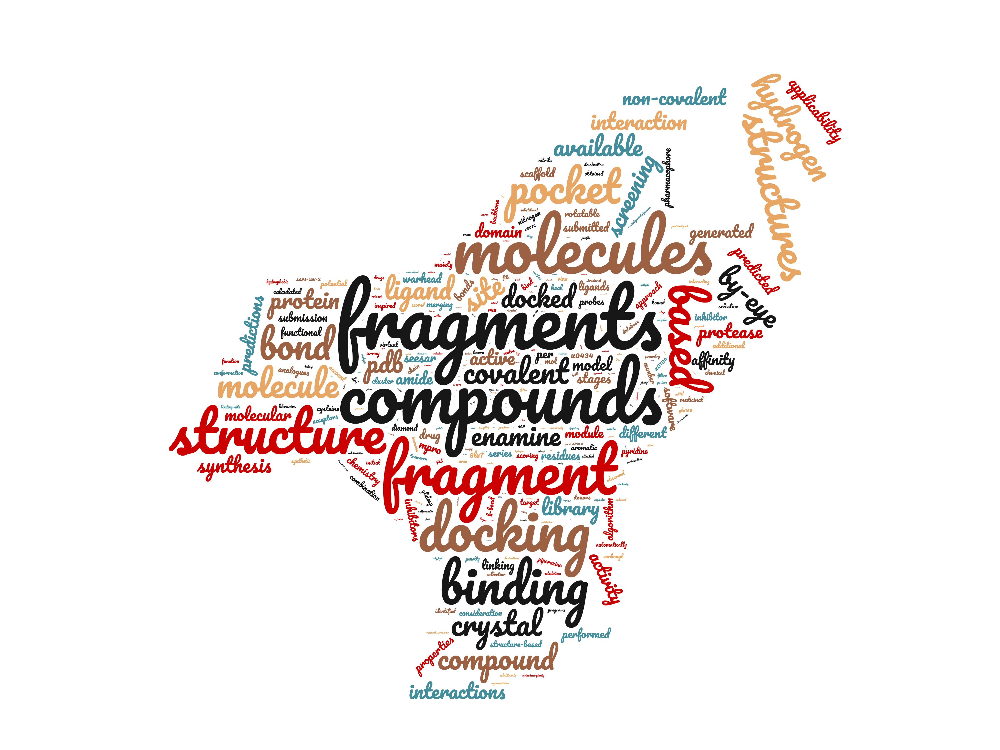

# Analysis of COVID Moonshot
In the Postera COVID Discorse site users can write a rationale for their submission: this is quick check of what they said.

(wordcloud generated via [wordclouds.com](https://www.wordclouds.com/))

## Columns in file
> TL;DR: see file moonshot_submissions.min.csv

Keys added:

* 'CID (canonical)': unique indetifier. Submission w/ same structure had same CID. Duplicates were removed —description combined.
* 'old_index': the order in which they were added in the postera site is kind of sequential
* 'clean_creator': the cleaned up creator field
* 'SMILES': this may be pre-reaction covalent
* 'new_smiles': smiles found in crystal
* 'fragments': inspirations. DIRTY AS OF 15/12/22. Not combined w/ cleaned set
* 'xcode': according to Fragalysis
* 'Structure ID': according to Postera
* 'site_name': fragalysis site
* 'pdb_entry'
* 'submission_date': from IC50 file
* 'inferred_submission_date': isotonic regression of the above
* 'order_date': true
* 'shipment_date': true 
* 'description': rationale + submission notes
* 'N_creator_submission': compounds in submission group N_creator_submission
* 'N_submission_group':
* 'resubmitted': was this submitted multiple times
* 'Enamine - REAL Space', 'Enamine - Extended REAL Space', 'Enamine - SCR', 'Enamine - BB', 'Mcule', 'Mcule Ultimate',
* 'N_chars', 'N_words', 'N_words_cutoff'
* keyword classification: 'classified_method'
* 'flesch', 'dale_chall': readability indices (>20 words or more)
* 'okay': keep?

## Methodology

Unfortunately, there was not a category of method, 
say `by-eye using Fragalysis` | `by-eye using other` | `docking of expansions` | `docking of mergers` | `docking of virtual library` | `structure-independent ML` | `other computational`. 
As a consequence, it is not clear directly what approach was used.

## Caveats
Furthermore, there was no limit on the amount of submissions a user could submit, but a recommendation to shortlist to make the triaging easier. 
However, this was blatantly ignored by some users who looked at the HTML ids and triggered ajax requests and made an API to submit thousands of compounds to advertise their software. As a consequence, the raw numbers of term instances does not mean too much. 

Submissions were triaged in multiple stages via a variety of methods, generally via multiple docking methods of varying complexity —some very sophisticated.
I was part of triaging team and used [Fragmenstein](https://github.com/matteoferla/Fragmenstein) to place the molecule close to the stated inspiration —skipping all VLS docking submissions. Furthermore, submissions came at different stages. Therefore, whether a submission was made may be influenced by various factors, such as submission date.

Hence why in the parsed dataset the field `freq_crystallised (of made)` is more important than `freq_crystallised (of total)`.

## Dataset
The submission info is from the [COVID moonshot submissions github repo](https://github.com/postera-ai/COVID_moonshot_submissions).

Each submission was done as a set all sharing the same `rationale`. 
So the table contains multiple rows/submitted compounds per submission. —say the CID `ANT-DIA-3c79be55-1` finishes in `-1`, that means that it is the first of the `ANT-DIA-3c79be55` set.
Consequently to not get a bias by number of submission for the word-cloud I removed all bar one submission per group.

I merged the "rationale" and "submission notes" columns into one ('words') as many users did not differentiate between the two,
and some words needed tweaking as found together (eg. 'by-eye').

## Word cloud

I remove common words using the 1,000 most common words taken from [someone's GitHub](https://gist.githubusercontent.com/deekayen/4148741/raw/98d35708fa344717d8eee15d11987de6c8e26d7d/1-1000.txt).
Along with a few more words that were not in the list but were common in the submissions
('file', 'assume', 'given', 'built', 'remove', 'previous', 'extra', 'mode', 'via', 'initial', 'report'),
while 'molecule', 'machine', 'dock', 'learn' were removed from the blacklist as they are important in the context of the submissions.

Additionally, grammatical inflections were collapsed albeit crudely.

## Keyword based logical categorisation

> See [categorisation notebook](initial_results/categorisation.ipynb)

I used a keyword based approach to categorise the submissions.
This is as expected very very crude as the only word to go by for some,
such as `manual_possibly` was the present of the words such as isoform or
simply verbosity.
The GitHub data is not undated (contains only 311 structures out of 500+)
and lacks a submission timestamp.
However, the order date can help to infer the wave the structures belong to.

This is important because the latter waves are elaborations,
so not relevant to the initial categorisation.
Here is across the whole of time (not just the first wave, ie. misleading).

|                 |   total |   ordered |   made |   crystallised |   crystal-over-made% |
|:----------------|--------:|----------:|-------:|---------------:|---------------------:|
| initial         |      99 |        93 |     93 |             49 |                   52 |
| old             |      44 |        17 |     14 |              4 |                   28 |
| manual          |    2757 |       314 |    226 |             44 |                   19 |
| manual_possibly |   10328 |      3080 |   2523 |            129 |                    5 |
| docking         |    7566 |       691 |    568 |             76 |                   13 |
| fep             |     175 |       100 |     55 |              9 |                   16 |
| unknown         |      28 |        19 |     17 |              0 |                    0 |
| total           |   20997 |      4314 |   3496 |            311 |                    8 |

While this is the first wave (ordered before 1st June 2020):

|                 |   total |   ordered |   made |   crystallised |   crystal-over-made% |
|:----------------|--------:|----------:|-------:|---------------:|---------------------:|
| initial         |       5 |         5 |      5 |              0 |                    0 |
| old             |      17 |        17 |     14 |              4 |                   28 |
| manual          |     164 |       164 |    102 |             26 |                   25 |
| manual_possibly |     314 |       314 |    205 |             46 |                   22 |
| docking         |     439 |       439 |    349 |             62 |                   17 |
| fep             |       1 |         1 |      1 |              1 |                  100 |
| unknown         |       6 |         6 |      5 |              0 |                    0 |
| total           |     946 |       946 |    681 |            139 |                   20 |

* `old` are compounds reported to work for proteases of SARS
* `manual` is an elaboration, merger, expansion, replacement, linker, that was not necessary done manually but not by docking
* `manual_possibly` is the same but with more ambiguity
* `docking` is a docking submission
* `fep` is a free energy perturbation submission (John Chodera's group)

