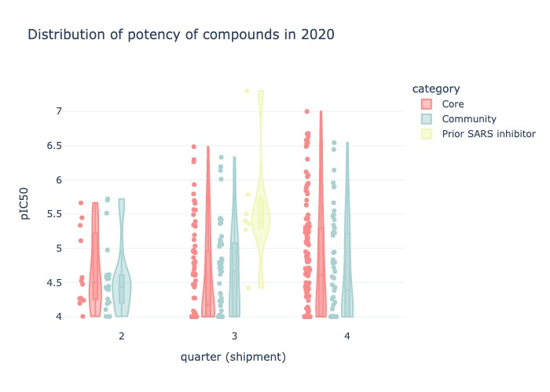
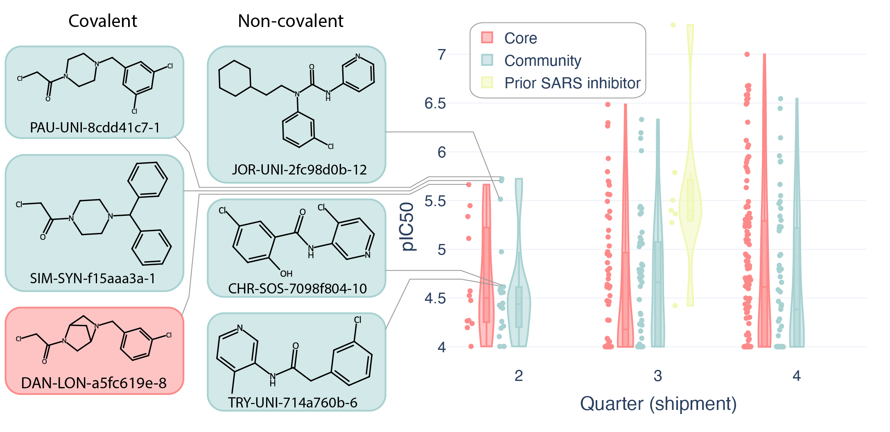
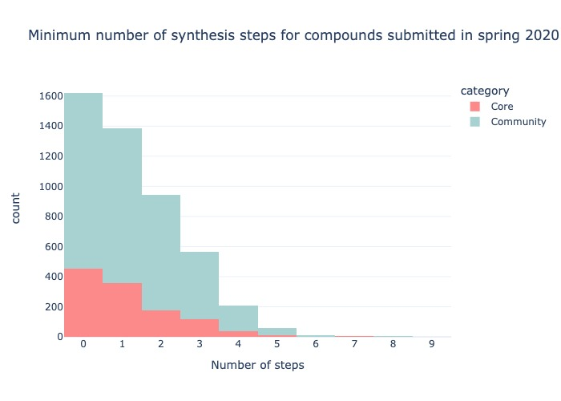
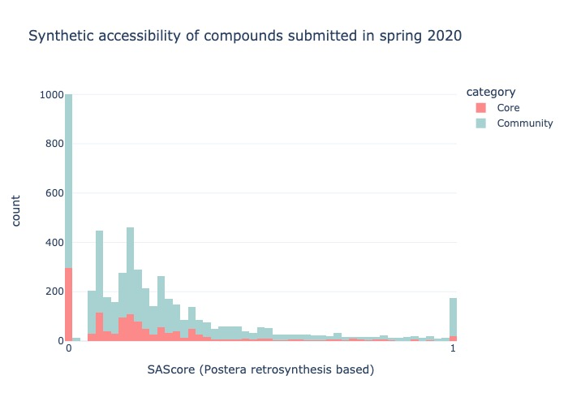
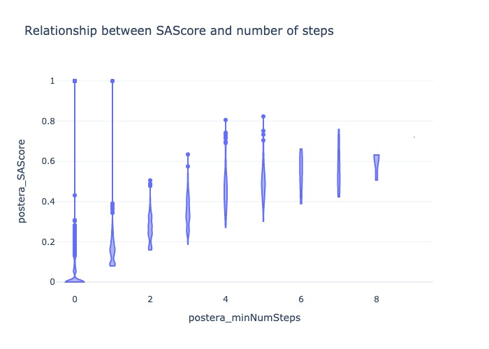
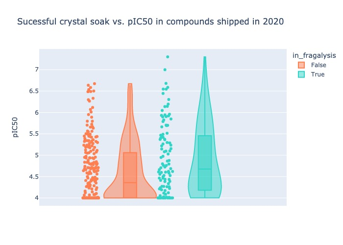
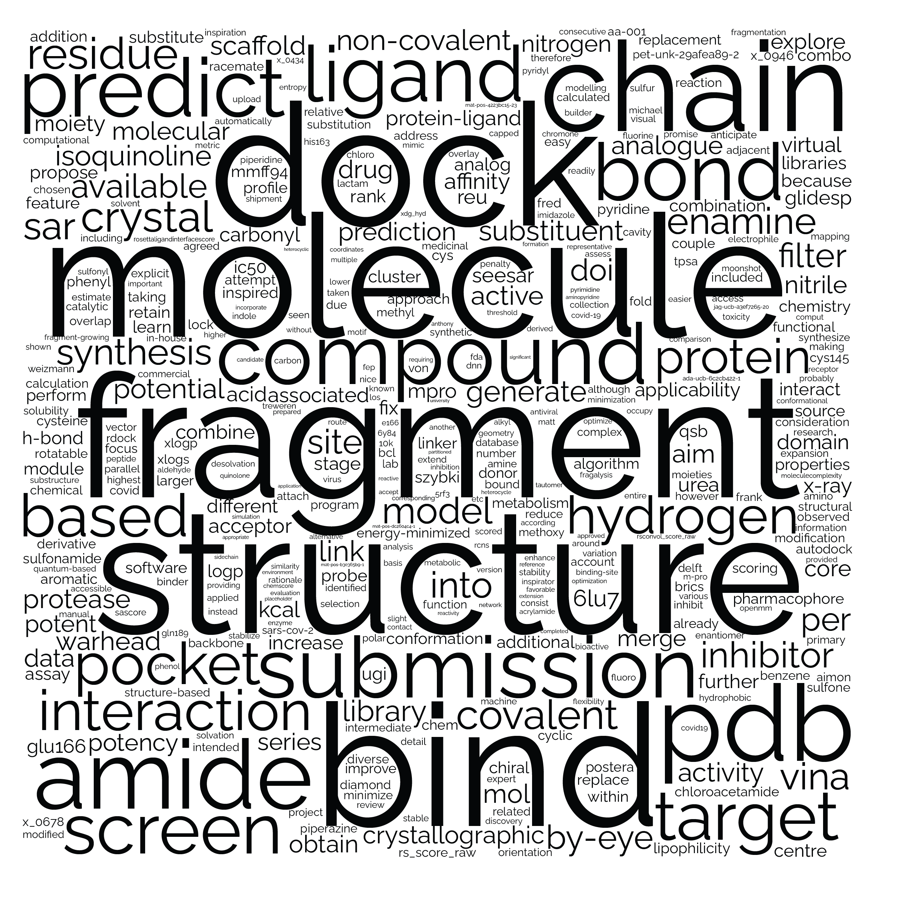
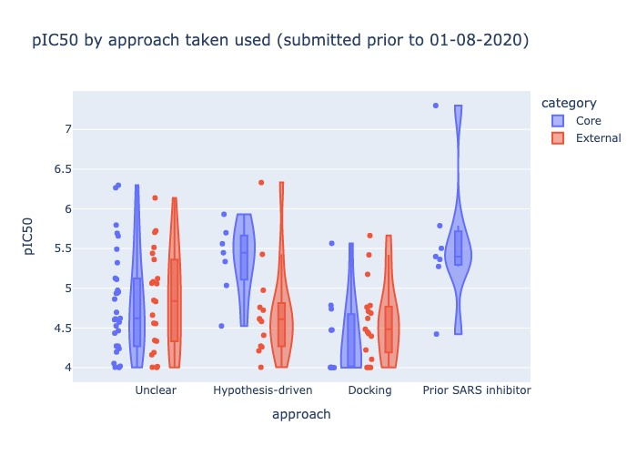
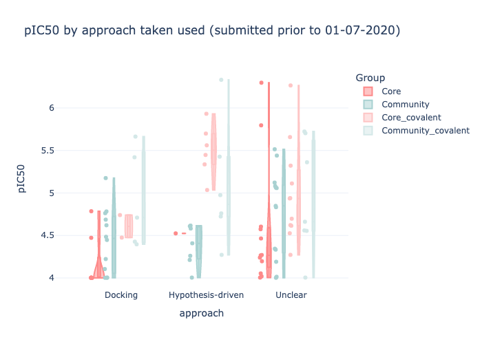
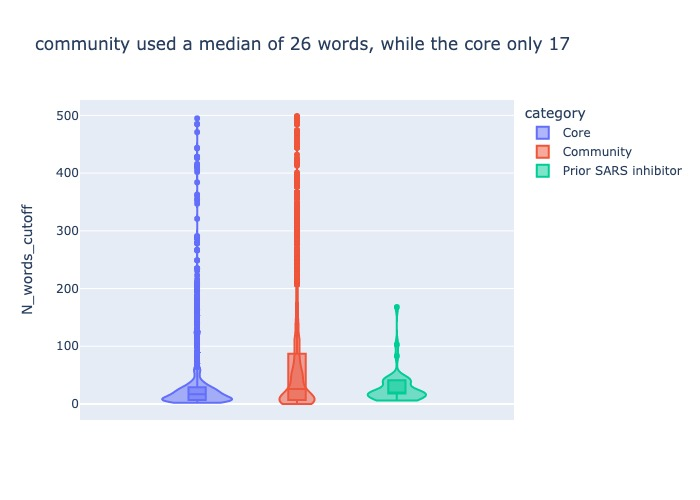

## Ingroup vs. outgroup

Labelled ([AI file](images/images/core-v-comm.png)):

Potency of compounds synthesised in 2020 grouped by designed from either core team or community submissions,
with insets of the top three chloroacetamide structures (left) and non-covalevent structures (right).

Further details: Starting from April 2020 (calendar Q2), ordered compounds were being tested.
The membership to the core group was fluid and grew with time, 
herein presence on the main discussion group (Slack workspace) was used.
The names from the submissions were polished as described in readme.

* to-do: export as SVG and add key compounds (e.g. Tryfon's) in illustrator.
* Notebook: [core-v-comm.ipynb](core-v-comm.ipynb)
* See also:  [Scatter plot form](images/core-v-comm_distro.jpg)

## Risk of crowd-sourcing

Postera number of steps is more reliable than SAScore as the latter sees natural products as non-drug-like.

Crowd sourced submissions are as synthetically achievable as opposed to being molecules drawn by kindergarteners.
In the spring 2020 submissions, the crowd-sourced submissions half have a SA score lower than 17%, which is close to the core submissions (median 13%, MAD: 10% and 11%, counts: 3919 and 1801 —data from first 5_000).

Steps is more sensible that SAScore due to natural products. The 25 worse compounds by SAScore are 7.0 or higher, but 11 are JSME doodles by kindergarteners, while the rest are natural products. This includes `FRA-DIA-6d2bfd8c-1`, invermectin by Frank.

As expected the more the lead develops the worse its SAScore is expected to be: [SAScore_corevcomm_vio.jpg](images/SAScore_corevcomm_vio.jpg)

Old figure using Earlt '09 SAScore [SAScore core vs community Covid Moonshot](images/SAScore_corevcomm_histo.jpg)

* Notebook: [SAScore.ipynb](SAScore.ipynb)
* to-do: Repeat with Postera Manifold

### Comedy entries

This is no longer a valid point given the above.

## Multi-approach

Soaking vs. pIC50

Compounds that presented density after soaking and pIC50 do not show a strong cutoff.
In the case of compounds w / low potency & discernible density these may bind outside of the pocket. The `site_name` is not informative,
and ought to be generated from the structures as opposed to being predicted.
Some compounds w/ high potency and no density may be experimental errors, but the soak.csv does not seem to be constructive.
The soak.csv must be only for a subset that did soak eventually as the success rate is way to high: [images/incomplete_soak.jpg](images/incomplete_soak.jpg)

Assuming everything was soaked is incorrect as plotting presence in Fragalysis and pIC50 shows that
in the distributions start to shift with time: [images/incomplete_soak2.jpg](images/incomplete_soak2.jpg)
Possibly replicates were not repeated if poor pIC50?

* Disregard
* Notebook: [soaks.ipynb](soaks.ipynb)

## Wordcloud

Rocket form [wordcloud.jpg](images/wordcloud.jpg)
Molcloud [molcloud.png](images/molcloud.png)

* Notebook: ???
* to-do: Nothing

## Method used

This is not a catalogue vs. generative difference as Fragalysis would fall under hypothesis driven yet is catalogue-based.

It should be noted that the biggest difference is in covalent vs. non-covalent:

Namely, the community was let narrowly focused on covalent compounds than the core team, especially for hypothesis-driven compounds.

## Footnote

Janke's colours:

* █ #FD8A8A
* █ #F1F7B5
* █ #A8D1D1
* █ #9EA1D4

## Disregarded

* The relationship between wordiness / readability and pIC50 is intriguing but is user dependent.
* Probably of being made is problematic and highly complicated

The wordiness is user dependent and core members were less wordy in the submissions,
presumably because the discussion was carried out outside of the submission form.

UMap of compounds by Tanimoto similarity on Morgan fingerpro

The number of synthetic steps does not affect the fingerprints [steps](images/dim-red-alt4.jpg)

