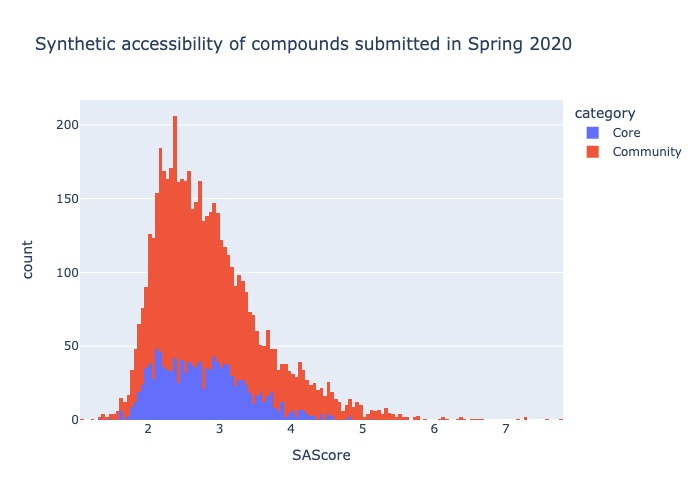
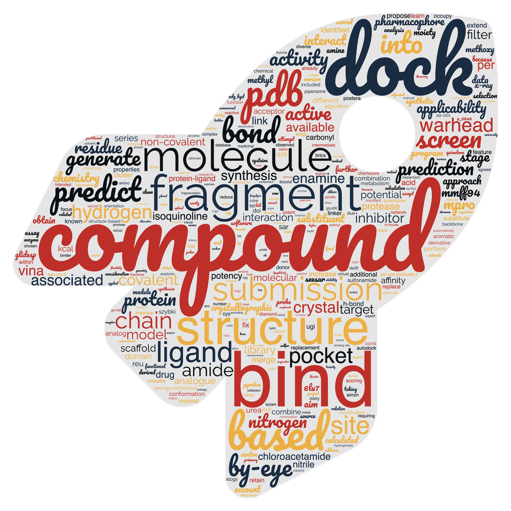

## Ingroup vs. outgroup

Starting from April 2020 (calendar Q2), ordered compounds were being tested.
The membership to the core group was fluid and grew with time, 
herein presence on the main discussion group (Slack workspace) was used.
The names from the submissions were posi

* Notebook: [core-v-comm.ipynb](core-v-comm.ipynb)
* to-do: export as SVG and add key compounds (e.g. Tryfon's) in illustrator.
* See also:  [Scatter plot form](images/core-v-comm_distro.jpg)

## Risk of crowd-sourcing

Crowd sourced submissions are synthetic accessibility as opposed to molecules drawn by kindergarteners.

As expected the more the lead develops the worse its SAScore is expected to be: [SAScore_corevcomm_vio.jpg](images/SAScore_corevcomm_vio.jpg)

In fact, in the spring 2020 submissions, the crowd-sourced submissions are 23.8% from catalogues, which is par with the core submissions (25.5%).

## Comedy entries from above

...

## Multi-approach

Soaking vs. pIC50

## Wordcloud

## Method used

...
