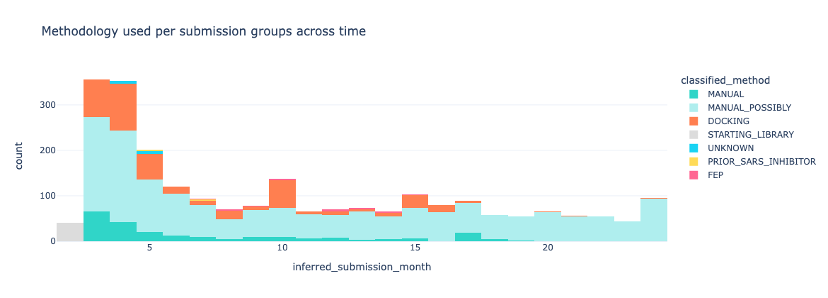
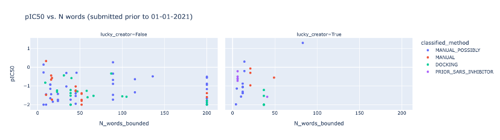

## Methodology

Unfortunately, there was not a category of method, 
say `by-eye using Fragalysis` | `by-eye using other` | `docking of expansions` | `docking of mergers` | `docking of virtual library` | `structure-independent ML` | `other computational`. 
As a consequence, it is not clear directly what approach was used.

Herein, the classification was as seen in [data_polishing.ipynb](data_polishing.ipynb):

```python
import enum, operator

class Method(enum.Enum):
    INITIAL = enum.auto()  # these were possibly poised library — not checked
    PRIOR_SARS_INHIBITOR = enum.auto()  # original SARS inhibitor
    MANUAL = enum.auto()
    MANUAL_POSSIBLY = enum.auto()
    DOCKING = enum.auto()
    FEP = enum.auto()
    UNKNOWN = enum.auto()


def classify(row):
    """
    The terms were picked following the classification of 100 or so compounds.
    """
    description: str = row.description.lower().str.replace('by eye', 'by-eye')
    
    def has_any_term(*terms):
        return any([term in description for term in terms])
        
    # This is an anomaly:
    if has_any_term('missing fragalysis structures',
                    'first batch of fragments so we have a moonshot cid for them',
                    'fragment that was missing an id not a design but a frament',
                   'second batch of submissions of fragments in order to generate moonshot cid',
                   'final set of fragments so we can generate moonshot cid'):
        return Method.UNKNOWN
    # SARS the original
    if has_any_term('sars inhibitor'):
        return Method.PRIOR_SARS_INHIBITOR
    # this might trip on words with fep in them like mifepristone ...
    if has_any_term('fep'):
        return Method.FEP
    # Docking
    if has_any_term('dock', 'seesar', 'vina', 'autodock', 'screen', 'drug-hunter', 'search'):
        return Method.DOCKING
    # This has to come after docking as many compounds were docked and best were picked by-eye
    if has_any_term('by-eye', 'merg', 'link', 'coupl'):
        return Method.MANUAL
    # These are very loose....
    if has_any_term('swap', 'racem', 'side product', 'intermediate', 'break',
                    'bioisoster', 'isomer', 'around', 'replace', 'isomer', 'enantiomer',
                    'introduction', 'substitution', 'shifted', 'combo',
                    'expansion', 'made by', 'design', 'idea', 'based', 'pairs',
                    'modification', 'derivative', 'common sense', 'suggested',
                    'similar to', 'analogues', 'easy to make', 'exploration', 'inspir', 'possible'):
        return Method.MANUAL_POSSIBLY
    if len(row.description) > 200:
        return Method.MANUAL_POSSIBLY 
    if row.fragments != 'x0072':  # the user is specifying compounds, whereas in blind docking this does not happen
        return Method.MANUAL_POSSIBLY
    return Method.UNKNOWN
    
classified = moonshot.apply(classify, axis=1)
moonshot['classified_method'] = classified.apply(operator.attrgetter('name'))
```
A fix was then done for the `moonshot.site_name.str.contains('XChem Screen')` compounds.

## Tally

|                      |   classified_method |
|:---------------------|--------------------:|
| MANUAL_POSSIBLY      |                1677 |
| DOCKING              |                 438 |
| MANUAL               |                 229 |
| STARTING_LIBRARY     |                  40 |
| FEP                  |                  21 |
| UNKNOWN              |                  13 |
| PRIOR_SARS_INHIBITOR |                   5 |

## vs Time



## vs IC50
Cutoff for words >200 (folk who submitted ChemRxiv abstracts etc.) Same submission group will have same N words.
Hence the vertical alignments.


|       |   DOCKING |   MANUAL |   MANUAL_POSSIBLY |   PRIOR_SARS_INHIBITOR |
|:------|----------:|---------:|------------------:|-----------------------:|
| pIC50 |  -1.50139 | -1.06432 |          -1.12418 |               -0.70833 |