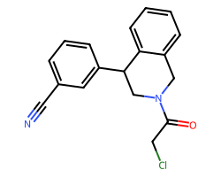

## Quarter 2
| CID (canonical)     |   pIC50 | category   | clean_creator       | description                                                                                                                                                                                                                                                                                                                                                                                                                                                                                                                                                                                                                                                                                                                                                                                                                                                                                                                                                                                                                                                                                                                                                                                                                                                                                                                                                                                                                                                                                                                                                                                                                                                                                                                                                                                                                                                                                                                                                                                                                                                                                                                                                                                                                                                                                                                                                                                                                                                                                                                              | fragments                                       | xcode   | xcode   | image                                                           |
|:--------------------|--------:|:-----------|:--------------------|:-----------------------------------------------------------------------------------------------------------------------------------------------------------------------------------------------------------------------------------------------------------------------------------------------------------------------------------------------------------------------------------------------------------------------------------------------------------------------------------------------------------------------------------------------------------------------------------------------------------------------------------------------------------------------------------------------------------------------------------------------------------------------------------------------------------------------------------------------------------------------------------------------------------------------------------------------------------------------------------------------------------------------------------------------------------------------------------------------------------------------------------------------------------------------------------------------------------------------------------------------------------------------------------------------------------------------------------------------------------------------------------------------------------------------------------------------------------------------------------------------------------------------------------------------------------------------------------------------------------------------------------------------------------------------------------------------------------------------------------------------------------------------------------------------------------------------------------------------------------------------------------------------------------------------------------------------------------------------------------------------------------------------------------------------------------------------------------------------------------------------------------------------------------------------------------------------------------------------------------------------------------------------------------------------------------------------------------------------------------------------------------------------------------------------------------------------------------------------------------------------------------------------------------------|:------------------------------------------------|:--------|:--------|:----------------------------------------------------------------|
| PAU-UNI-8cdd41c7-1  | 5.72354 | Community  | Paul Brear          | Combination fo x0770 and x0692. by eye.                                                                                                                                                                                                                                                                                                                                                                                                                                                                                                                                                                                                                                                                                                                                                                                                                                                                                                                                                                                                                                                                                                                                                                                                                                                                                                                                                                                                                                                                                                                                                                                                                                                                                                                                                                                                                                                                                                                                                                                                                                                                                                                                                                                                                                                                                                                                                                                                                                                                                                  | x0770                                           |         |         |    |
| SIM-SYN-f15aaa3a-1  | 5.70333 | Community  | Simon Williams      | Noting that the benzylic group on fragments such as x0692 and x1334 can orient in different directions but the rest of the fragments overlay very well. Combination of these two fragment should fill both hydrophobic pockets. A simpler combination would be to have symmetrical aryl groups                                                                                                                                                                                                                                                                                                                                                                                                                                                                                                                                                                                                                                                                                                                                                                                                                                                                                                                                                                                                                                                                                                                                                                                                                                                                                                                                                                                                                                                                                                                                                                                                                                                                                                                                                                                                                                                                                                                                                                                                                                                                                                                                                                                                                                           | x0692,x1334                                     | x3348   | x3348   |    |
| DAN-LON-a5fc619e-8  | 5.66354 | Core       | Daniel Zaidman      | The inspiration is X_0770, one of the covalent fragments. I based these designs on a simple 3-step synthetic route with commercially available boc-protected piperazines. First step is nucleophilic substitution with 1-(bromomethyl)-3-chlorobenzene, then deprotection, and then amidation with 2-chloroacetyl chloride. I docked them using the constrained scaffold of X_0770, and chose that seem compatible. Also,  I predict that the ones with the substitution next to the chloroacetamide will have reduced electrophile reactivity due to steric hindrance. If you have any questions, feel free to email me                                                                                                                                                                                                                                                                                                                                                                                                                                                                                                                                                                                                                                                                                                                                                                                                                                                                                                                                                                                                                                                                                                                                                                                                                                                                                                                                                                                                                                                                                                                                                                                                                                                                                                                                                                                                                                                                                                                 | x0770                                           | x3077   | x3077   |    |
| JOR-UNI-2fc98d0b-12 | 5.51428 | Community  | Jordi JuarezJimenez | These compounds are based on the fragment X_0434. We propose functionalization of the benzene ring with a halogen atom to occupy the pocket formed by the side chains of M165 H41 and F181 (as several other fragments occupy this pocket) and we aim at occupying an adjacent pocket via a double alkylation of the urea with a series of groups inspired either by the structures of other fragments (e. g: X_0991)  or other groups common in MedChem (e. g. morpholine). The compounds were manually built in Maestro and minimised to reduce steric clashes We followed a strategy similar to the one described in De Simone et al Chemical Science 2018 (https://doi. org/10. 1039/C8SC03831G) and we suggest that the chemistry described in that work may be helpful to devise synthetic routes for these compounds                                                                                                                                                                                                                                                                                                                                                                                                                                                                                                                                                                                                                                                                                                                                                                                                                                                                                                                                                                                                                                                                                                                                                                                                                                                                                                                                                                                                                                                                                                                                                                                                                                                                                                              | x0387,x0434,x0991                               | x10236  | x10236  |  |
| NIR-THE-0d6461ce-8  | 5.44733 | Core       | Nir London          | x0692, x0770 and x0830 are all chloroacetamides off of piperazines that adopt very similar conformations. Since piperazine chloroacetamides  are more reactive from piperidine chloroacetamides, I switched all designs to piperidines with either a CH2 or NH linker (more synthesizable?)  These poses were merged with: x0104, x0195, x0161, x0305, x1334.                                                                                                                                                                                                                                                                                                                                                                                                                                                                                                                                                                                                                                                                                                                                                                                                                                                                                                                                                                                                                                                                                                                                                                                                                                                                                                                                                                                                                                                                                                                                                                                                                                                                                                                                                                                                                                                                                                                                                                                                                                                                                                                                                                            | x0104,x0161,x0195,x0305,x0692,x0770,x0830,x1334 |         |         |    |
| DAR-DIA-fb20be43-6  | 5.3363  | Core       | Daren Fearon        | Merging of x0830 with x0305/x0104 and x0195 to target S1 pocket in addition to Cys145                                                                                                                                                                                                                                                                                                                                                                                                                                                                                                                                                                                                                                                                                                                                                                                                                                                                                                                                                                                                                                                                                                                                                                                                                                                                                                                                                                                                                                                                                                                                                                                                                                                                                                                                                                                                                                                                                                                                                                                                                                                                                                                                                                                                                                                                                                                                                                                                                                                    | x0104,x0195,x0305,x0830                         |         |         |    |
| MED-COV-4280ac29-13 | 5.11182 | Core       | Med-Chem team       | These are substitutions on submissions by the MedChem team at COVID Moonshot based on the following methodology to improve both synthesis and med-chem properties:         For compounds that are purchasable, leave as is    For naked thiophene, replace with phenyl    For bromo or chloro thiophene, replace with a chloro phenyl (with halo in the appropriate position, usually meta)         We are indebted to the original submitters of these compounds, as detailed here:    https://docs. google. com/spreadsheets/d/1QgWuvqPmvIqdG1YHyRdWRWiIRkThTKJzXN3_SQcqUr4/edit?usp=sharing. No fragments were used by us in this substitution procedure                                                                                                                                                                                                                                                                                                                                                                                                                                                                                                                                                                                                                                                                                                                                                                                                                                                                                                                                                                                                                                                                                                                                                                                                                                                                                                                                                                                                                                                                                                                                                                                                                                                                                                                                                                                                                                                                              | x0072                                           |         |         |  |
| DUN-NEW-f8ce3686-22 | 4.97469 | Community  | Duncan Miller       | Merging of x0072 with x1458 to combine the covalent warhead of x1458 with the sulfonamide fragment x1458 (Designs arrived at by overlay of crystal structures in Biovia Discovery Viewer, and identifying common vectors for fragment growth/merging by eye, with synthetic accessibility taken into account).                                                                                                                                                                                                                                                                                                                                                                                                                                                                                                                                                                                                                                                                                                                                                                                                                                                                                                                                                                                                                                                                                                                                                                                                                                                                                                                                                                                                                                                                                                                                                                                                                                                                                                                                                                                                                                                                                                                                                                                                                                                                                                                                                                                                                           | x0072,x1458                                     |         |         |  |
| CHR-SOS-7098f804-10 | 4.61618 | Community  | Chris De Graaf      | Structure-based design combining:  1) X_0678 and X_0107 (targeting the S1 and S1  pockets)  2) X_0161, X_0195, X_0946 (providing a vector to target the S3 pocket from the S1  pocket)  3) The recently reported niclosamide hit (not reviewed pre-print, https://www. biorxiv. org/content/10. 1101/2020. 02. 25. 965582v2)    The N-phenylbenzamide scaffold of Niclosamide may bind in similar way as the benzamide (X_0678) and (di)phenylurea (X_0434) scaffolds observed in several fragments. Obviously early days and appreciating that recognising simple substructures between hits and assuming they bind in a similar manner can be deceiving. I have therefore also included 9 designs to efficiently explore simple SAR around the putative niclosamide hit, which can be helpful to provide more confidence in the binding mode hypothesis and customise/extend the scope of the associated designs. The cross-over designs include:  - Incorporation of the 3-pyridine nitrogen H-bond acceptor targeting H163 in the S1 pocket into the niclosamide N-phenylbenzamide scaffold  - Exploration of different vectors and linkers to grow from the lipophilic S1  pocket into the S3 pocket with and without the sulphonamide of X_0161/X_0195/X_0946. Structure-based design combining:  1) X_0678 and X_0107 (targeting the S1 and S1  pockets)  2) X_0161, X_0195, X_0946 (providing a vector to target the S3 pocket from the S1  pocket)  3) The recently reported niclosamide hit (not reviewed pre-print, https://www. biorxiv. org/content/10. 1101/2020. 02. 25. 965582v2)    The N-phenylbenzamide scaffold of Niclosamide may bind in similar way as the benzamide (X_0678) and (di)phenylurea (X_0434) scaffolds observed in several fragments. Obviously early days and appreciating that recognising simple substructures between hits and assuming they bind in a similar manner can be deceiving. I have therefore also included 9 designs to efficiently explore simple SAR around the putative niclosamide hit, which can be helpful to provide more confidence in the binding mode hypothesis and customise/extend the scope of the associated designs. The cross-over designs include:  - Incorporation of the 3-pyridine nitrogen H-bond acceptor targeting H163 in the S1 pocket into the niclosamide N-phenylbenzamide scaffold  - Exploration of different vectors and linkers to grow from the lipophilic S1  pocket into the S3 pocket with and without the sulphonamide of X_0161/X_0195/X_0946 | x0107,x0161,x0195,x0678,x0946                   |         |         |  |
| TRY-UNI-714a760b-6  | 4.60906 | Community  | Tryfon Zarganis     | The design of the molecules was done by superimposing the different fragments from the crystal structures (by eye). The reactions should be fairly easy urea formation or amide coupling all from readily available starting materials. Fragments used for the conception of the ideas are the following  x0107, x0434, x0678, x0748, x0995, x1382.                                                                                                                                                                                                                                                                                                                                                                                                                                                                                                                                                                                                                                                                                                                                                                                                                                                                                                                                                                                                                                                                                                                                                                                                                                                                                                                                                                                                                                                                                                                                                                                                                                                                                                                                                                                                                                                                                                                                                                                                                                                                                                                                                                                      | x0107,x0434,x0678,x0748,x0995,x1382             | x2646   | x2646   |    |
## Quarter 3
| CID (canonical)     |   pIC50 | category             | clean_creator    | description                                                                                                                                                                                                                                                                                                                                                                                                                                                                                                                                                                                                                                                 | fragments                     | xcode   | xcode   | image                                                           |
|:--------------------|--------:|:---------------------|:-----------------|:------------------------------------------------------------------------------------------------------------------------------------------------------------------------------------------------------------------------------------------------------------------------------------------------------------------------------------------------------------------------------------------------------------------------------------------------------------------------------------------------------------------------------------------------------------------------------------------------------------------------------------------------------------|:------------------------------|:--------|:--------|:----------------------------------------------------------------|
| ALP-POS-c59291d4-5  | 7.30103 | Prior SARS inhibitor | Alpha Lee        | Old SARS inhibitors, synthesised by Sai. Short SAR proposed on active compound ALP-POS-c59291d4-5                                                                                                                                                                                                                                                                                                                                                                                                                                                                                                                                                           |                               | x10812  | x10812  |    |
| MAT-POS-e10a589d-1  | 6.48545 | Core                 | Matthew Robinson | Hits from Weizmann HTS that are available from Enamine as screening compounds.                                                                                                                                                                                                                                                                                                                                                                                                                                                                                                                                                                              |                               |         |         |    |
| DAV-CRI-14a23e73-1  | 6.33161 | Community            | David Briggs     | By eye merging of X0161 and x1382, retaining covalent warhead                                                                                                                                                                                                                                                                                                                                                                                                                                                                                                                                                                                               | x0161,x1382                   |         |         |    |
| LON-WEI-ff7b210a-4  | 6.29757 | Core                 | Nir London       | Enamine-available hits (>80% inhibition at 10uM) from the HTS against Mpro run at Weizmann.                                                                                                                                                                                                                                                                                                                                                                                                                                                                                                                                                                 |                               |         |         |    |
| MED-COV-4280ac29-30 | 6.2652  | Core                 | Med-Chem team    | These are substitutions on submissions by the MedChem team at COVID Moonshot based on the following methodology to improve both synthesis and med-chem properties:         For compounds that are purchasable, leave as is    For naked thiophene, replace with phenyl    For bromo or chloro thiophene, replace with a chloro phenyl (with halo in the appropriate position, usually meta)         We are indebted to the original submitters of these compounds, as detailed here:    https://docs. google. com/spreadsheets/d/1QgWuvqPmvIqdG1YHyRdWRWiIRkThTKJzXN3_SQcqUr4/edit?usp=sharing. No fragments were used by us in this substitution procedure | x0072                         |         |         |  |
| BEN-DND-93268d01-8  | 6.19518 | Community            | Benjamin Perry   | Building structural data around  confirmed non-covalent hitsTRY-UNI-714a760b-6 and JAN-GHE-83b26c96-4 : checked submissions list for compounds which were not available via commercial or Enamine sources, and designed new compounds around this - Note: not designed via docking or structure per se. Componuds will be suggested for synthesis at DNDi Open Synthesis Network OSN. Addressing the attractive singleton BEN-DND-93268d01-8 with a remake and 3 close analogues to see if any potency is retained                                                                                                                                          |                               | x11417  | x11417  |    |
| ADA-UCB-6c2cb422-1  | 6.13787 | Community            | Adam Smalley     | Designs submitted by the UCB med-chem team.                                                                                                                                                                                                                                                                                                                                                                                                                                                                                                                                                                                                                 |                               | P2005   | P2005   |    |
| TAT-ENA-80bfd3e5-1  | 6.011   | Community            | Tetiana Matviyuk | 50 compounds that showed > 50% inhibition at 20 uM of molecules sent by Enamine s Computational+Med-Chem Team to Weizmann for fluorescence assay. To be confirmed by IC50. submitted to system by Matt form PostEra on behalf of London Lab and Enamine. Hits from Weizmann HTS that are available from Enamine as screening compounds.                                                                                                                                                                                                                                                                                                                     |                               |         |         |    |
| NIR-THE-c331be7a-2  | 5.93181 | Core                 | Nir London       | These are all based on merges of:  - x1420 as a base covalent fragment with:    - x0305, x0195, x0874 and x0104.                                                                                                                                                                                                                                                                                                                                                                                                                                                                                                                                            | x0104,x0195,x0305,x0874,x1420 | x10678  | x10678  |    |
| LON-WEI-ff7b210a-5  | 5.79588 | Core                 | Nir London       | Enamine-available hits (>80% inhibition at 10uM) from the HTS against Mpro run at Weizmann.                                                                                                                                                                                                                                                                                                                                                                                                                                                                                                                                                                 |                               |         |         |    |
## Quarter 4
| CID (canonical)     |   pIC50 | category             | clean_creator    | description                                                                                                                                                                                                                                                                                                                                                                                                                                                                                                                                                                                                                                                                                                                                                                                                       | fragments   | xcode   | xcode   | image                                                           |
|:--------------------|--------:|:---------------------|:-----------------|:------------------------------------------------------------------------------------------------------------------------------------------------------------------------------------------------------------------------------------------------------------------------------------------------------------------------------------------------------------------------------------------------------------------------------------------------------------------------------------------------------------------------------------------------------------------------------------------------------------------------------------------------------------------------------------------------------------------------------------------------------------------------------------------------------------------|:------------|:--------|:--------|:----------------------------------------------------------------|
| ALP-POS-c59291d4-5  | 7.30103 | Prior SARS inhibitor | Alpha Lee        | Old SARS inhibitors, synthesised by Sai. Short SAR proposed on active compound ALP-POS-c59291d4-5                                                                                                                                                                                                                                                                                                                                                                                                                                                                                                                                                                                                                                                                                                                 |             | x10812  | x10812  |    |
| MAT-POS-f2460aef-1  | 7       | Core                 | Matthew Robinson | Getting enantiopure samples of LON-WEI-2e27a2e5-1, while also attempting some furan replacements.                                                                                                                                                                                                                                                                                                                                                                                                                                                                                                                                                                                                                                                                                                                 |             | P0009   | P0009   |    |
| MAT-POS-b3e365b9-1  | 6.67985 | Core                 | Matthew Robinson | Enantiopure analogs of VLA-UCB-1dbca3b4-15 for confirmatory stories.                                                                                                                                                                                                                                                                                                                                                                                                                                                                                                                                                                                                                                                                                                                                              |             | x11612  | x11612  |    |
| ALP-POS-3b848b35-2  | 6.67366 | Core                 | Alpha Lee        | Elaboration on ADA-UCB-6c2cb422-1. Easy to make molecules from Enamine building blocks that probe the p1-p2 site binders. Adding beta lactam P3 unit to potent isoquinoline.                                                                                                                                                                                                                                                                                                                                                                                                                                                                                                                                                                                                                                      |             |         |         |    |
| EDJ-MED-e4b030d8-2  | 6.63639 | Core                 | Ed Griffen       | Follow ups to VLA-UCB-1dbca3b4-15 using MPro-x10942 as structural guidance. Stereochemistry is preferred. Key goal is to bias amide into axial position conformation and add small substituents to increase potency. Many of these designs are built from those developed for JAG-UCB-a3ef7265-20. So additional inspirations include: VLA-UCB-1dbca3b4-14  MIK-NEW-7f99bfc4-1  BAR-COM-ace1b61b-3  BAR-COM-ace1b61b-2  BAR-COM-ace1b61b-1  JAN-GHE-299e5c7e-4  MAT-POS-e478a234-1  RAL-THA-f8a0f917-3  RAL-THA-f8a0f917-2  RAL-THA-f8a0f917-1  EDG-MED-4b32601a-1  EDG-MED-fe7487f8-2  NAU-LAT-8502cac5-3. Isolated intermediates of the synthesis.                                                                                                                                                              |             |         |         |    |
| ALP-POS-477dc5b7-2  | 6.5867  | Core                 | Alpha Lee        | Expanding hit by testing role of the oxygen and expanding into P1 . Various substitutions of chromane system - recycled from probably inactive aminotriazole compounds.                                                                                                                                                                                                                                                                                                                                                                                                                                                                                                                                                                                                                                           |             | x12171  | x12171  |    |
| EDJ-MED-c314995a-1  | 6.58336 | Core                 | Ed Griffen       | Hybrid of potent isoquinoline and cyclohexyl urea. Docking and alignment of ideas to existing compounds and crystal structures.                                                                                                                                                                                                                                                                                                                                                                                                                                                                                                                                                                                                                                                                                   |             |         |         |    |
| EDJ-MED-e4b030d8-13 | 6.54668 | Core                 | Ed Griffen       | Follow ups to VLA-UCB-1dbca3b4-15 using MPro-x10942 as structural guidance. Stereochemistry is preferred. Key goal is to bias amide into axial position conformation and add small substituents to increase potency. Many of these designs are built from those developed for JAG-UCB-a3ef7265-20. So additional inspirations include: VLA-UCB-1dbca3b4-14  MIK-NEW-7f99bfc4-1  BAR-COM-ace1b61b-3  BAR-COM-ace1b61b-2  BAR-COM-ace1b61b-1  JAN-GHE-299e5c7e-4  MAT-POS-e478a234-1  RAL-THA-f8a0f917-3  RAL-THA-f8a0f917-2  RAL-THA-f8a0f917-1  EDG-MED-4b32601a-1  EDG-MED-fe7487f8-2  NAU-LAT-8502cac5-3. Designed to disrupt planarity of the current lead componuds, thus positively impacting solubility                                                                                                     |             | x12207  | x12207  |  |
| PET-UNK-1901c25b-1  | 6.54516 | Community            | Peter Kenny      | Three structural variations of ALP-POS-d2866bdf-1 (x10876) that are intended to map the structure-activity relationship for this series. [1] Replace P1 benzotriazole with isoquinoline (good P1 substituent in 3-aminoquinoline series) [2] Replace dimethylamino group with methylsulfonyl (this is intended to exploit shallow concave region on protein surface, will also make the benzene ring less electron rich and is likely to lead to better solubility) [3] Replace thiophene with pyrazole in attempt to donate a hydrogen bond to backbone carbonyl  oxygen of E166 (this has been observed in fragment  structures such as AAR-POS-d2a4d1df-2 (X0104) The docking file contains the protein and ligand structures for ALP-POS-d2866bdf-1 (X10876) and proposed binding modes for the three designs |             | x11790  | x11790  |    |
| MAT-POS-f2460aef-3  | 6.53462 | Core                 | Matthew Robinson | Getting enantiopure samples of LON-WEI-2e27a2e5-1, while also attempting some furan replacements.                                                                                                                                                                                                                                                                                                                                                                                                                                                                                                                                                                                                                                                                                                                 |             |         |         |    |